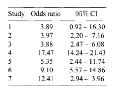
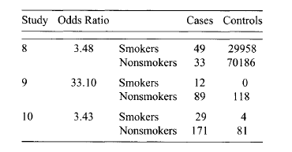

<style>
  .col2 {
    columns: 2 200px;         /* number of columns and width in pixels*/
    -webkit-columns: 2 200px; /* chrome, safari */
    -moz-columns: 2 200px;    /* firefox */
  }
 </style>

## A simple motivating example
- Suppose $K$ groups or units under investigation:
    - a sample of responses $Y_{ik}$, $i=1,\ldots n_k$ and $k = 1,\ldots, K$

Consider two alternative models:

1. A model that estimates a common mean effect $\mu$ (pooled effect)
    - when a normal distribution is assume, the model is expressed as
    $$
    Y_{ik} \sim N(\mu,\sigma^2) \text{ for } i=1,\ldots n_k \text{ and } k = 1,\ldots, K
    $$
2. A model that estimates different independent mean effects $\mu_k$ for each group (fixed effects)
    - when a normal distribution is assume, the model is expressed as
    $$
    Y_{ik} \sim N(\mu_k,\sigma^2) \text{ for } i=1,\ldots n_k \text{ and } k = 1,\ldots, K
    $$


## A simple motivating example 
    
$$
  Y_{ik} \sim N(\mu_k,\sigma^2) \text{ for } i=1,\ldots n_k \text{ and } k = 1,\ldots, K
$$

- It estimates the expected performance of each group/unit
- Each mean effect $\mu_k$ is estimated independently from the other groups
    - in a group with small sample size, the posterior uncertainty will be large
- It is logical to assume all $\mu_k$s are observables from a popolation distribution with mean $\mu$, an overall population average effect
$$
\mu_k \sim N(\mu,w^2)
$$
- All mean effects allow for _borrowing strengh_ between groups/units
    - the posterior mean of each $\mu_k$ is a weighted mean of the corresponding sample mean of the $k$-group and the overall mean effect $\mu$


## Repeated measurements of blood pressure

- Consider the repeated measurements of blood pressure from 20 healthy individuals
    - the aim is to estimate within-individual and between-individual variability

```{r echo=FALSE, warning=FALSE, message=FALSE, results='asis'}
library(stargazer)
library(knitr)
library(xtable)
ex9_1.blood <- list(n=20, K=2, 
y=structure(.Data=c(108, 98, 91, 94, 93, 96, 104, 99, 99, 97, 95, 98, 93, 97, 99, 96, 90, 100, 92, 95, 101, 89, 97, 97, 97, 100, 96, 95, 106, 100, 100, 98, 90, 99, 88, 98, 92, 92, 100, 101), 
.Dim = c(2, 20) )
)

z <- cbind(c('1st','2nd'),ex9_1.blood$y)
colnames(z) <- c('Individual',as.character(1:20))

print(kable(z, digits=0), type='html',  html.table.attributes = "border=0")

```


## Model formulation

$$
Y_{ij} = \mu + a_i + \epsilon_{ij} \quad \text{with } \epsilon_{ij}\sim N(0,\sigma^2) \text{ and } a_i\sim N(0,\sigma_a^2)
$$

equivalently

$$
Y_{ij} \sim N(\mu_{ij}, \sigma^2) \quad \text{with } \mu_{ij}=\mu + a_i  \text{ and } a_i\sim N(0,\sigma_a^2)
$$

- $\sigma^2_a$ (random effects variance): it measures the between-subject variability
- $\sigma^2$: it accounts for the remaining within-subject variability

- Prior distributions with large variances can be used when no information is available
$$
\mu \sim N(0, 1000) \quad \sigma^2\sim IG(0.001, 0.001) \text{ and } \sigma^2_a\sim IG(0.001, 0.001)
$$

## Equivalent model formulation
This model is equivalent to assuming
$$
{\mathbf y}_i \vert \mu, \sigma^2, \sigma^2_a \sim N_2\left( \boldsymbol{\mu}, \left[
\begin{array} {cc}
\sigma^2 + \sigma^2_a &  \sigma^2_a \\
\sigma^2_a &  \sigma^2 + \sigma^2_a\\ 
\end{array}\right]
\right)
$$
where $\mathbf y_i = (Y_{i1}, Y_{i2})^T$ and $\boldsymbol{\mu} = (1,1)^T$ and the parameters are given by

$$
\begin{eqnarray}
E(Y_{ij}) & = & \mu\\
Var(Y_{ij}) & = & Var(a_i) + Var(\epsilon_{ij}) = \sigma_a^2 + \sigma^2 \\
Cov(Y_{i1}, Y_{i2}) & = & Cov(\mu + a_i + \epsilon_{i1}, \mu + a_i + \epsilon_{i2}) \\
 & = & Var(a_i) + Cov(a_i,\epsilon_{i2}) +  Cov(\epsilon_{i1}, a_i) + 
 Cov(\epsilon_{i1},\epsilon_{i2})\\
& = & \sigma_a^2
\end{eqnarray}
$$

## Model formulation

- The total variability of the response $Y_{ij}$ is equal to $\sigma^2_a +\sigma^2$
- The covariance between two measurements of subject $i$ is equal to the between-subject variability (the random effect variance)
- The within-subject correlation is given by
$$
r_{12} = Cor(Y_{i1}, Y_{i2}) = \frac{\sigma_a^2}{\sigma^2_a +\sigma^2}
$$

- The two model formulation are equivalent but _the hierarchical structure_:
    - facilitates the model
    - provides estimates of individual effects
    
    
## Model formulation in BUGS {.smaller}

```{r, eval=FALSE}

model {
	for  (i  in 1:n) { 
	       for (j in 1:K){ 
	                 y[i,j] ~ dnorm( mu[i,j], tau )
	                 mu[i,j] <- m + a[i]
		  }
		a[i]~dnorm( 0, tau.a)
    }		
	# prior distributions
	m ~ dnorm( 0.0, 0.001)
	tau~dgamma(0.001, 0.001)
	tau.a~dgamma(0.001, 0.001)

	s2   <- 1/tau
	s2.a <- 1/tau.a
	ts2  <- s2+s2.a
	
	cor <- s2.a/ts2
```


## OpenBUGS through R2OpenBUGS {.smaller}

```{r model}

mymodel = function() {
	for  (i  in 1:n) { 
	       for (j in 1:K){ 
	                 y[i,j] ~ dnorm( mu[i,j], tau )
	                 mu[i,j] <- m + a[i]
		  }
		a[i]~dnorm( 0, tau.a)
    }		
	# prior distributions
	m ~ dnorm( 0.0, 0.001)
	tau~dgamma(0.001, 0.001)
	tau.a~dgamma(0.001, 0.001)

	s2   <- 1/tau
	s2.a <- 1/tau.a
	ts2  <- s2+s2.a
	
	cor <- s2.a/ts2
}
```

## OpenBUGS through R2OpenBUGS {.smaller}

```{r r2open, dependson='model', eval=FALSE}
library(R2OpenBUGS)

data <- list(n=20, K=2, 
y=structure(.Data=c(108, 98, 91, 94, 93, 96, 104, 99, 99, 97, 95, 98, 93, 97, 99, 96, 
90, 100, 92, 95, 101, 89, 97, 97, 97, 100, 96, 95, 106, 100, 100, 98, 90, 99, 88, 98,  
92, 92, 100, 101), .Dim = c(20, 2) ) )

bugsInits <- function() {
  return(list(m=0, tau = 0.001, tau.a = 0.001, a=rep(1,20)))}

parameters <- c('m', 'tau', 'tau.a', 's2','s2.a','ts2','cor')

resbugs = bugs(data, inits=bugsInits, parameters.to.save=parameters, model.file=mymodel,
n.chains=1, n.iter=10000, n.burnin=2000, n.thin=1,
                debug=TRUE, DIC=T)


```


## Results {.smaller}

```{r, results='asis', echo=FALSE}
library(knitr)
library(xtable)
load('material\\resbugs.RData')
print(kable(resbugs$summary[1:7,], digits=2), type='html',  html.table.attributes = "border=0")

```


## Plot of the random effects 

```{r, results='asis', eval=FALSE}
library(plotrix)
randomEffects <- resbugs$sims.list$a

SS <- apply(randomEffects, 2, FUN = function(x)
  {c(quantile(x, probs = c(0.025)), mean(x), quantile(x, probs = c(0.975)))})

plotCI(SS[2,],1:20, err='x', ui = SS[3,], li = SS[1,], xlab='', ylab='')
abline(v=0, lty=2)
```

## Plot of the random effects 

```{r, results='asis', echo=FALSE, warning=FALSE, message=FALSE}
library(plotrix)
load('material\\resbugs.RData')
randomEffects <- resbugs$sims.list$a
SS <- apply(randomEffects, 2, FUN = function(x){c(quantile(x, probs = c(0.025)), mean(x), quantile(x, probs = c(0.975)))})
plotCI(SS[2,],1:20, err='x', ui = SS[3,], li = SS[1,], xlab='', ylab='')
abline(v=0, lty=2)
```

## OpenBUGS through BRugs {.smaller}

```{r brugs, eval=FALSE}

modelString <- "model {
	for  (i  in 1:n) { 
	       for (j in 1:K){ 
	                 y[i,j] ~ dnorm( mu[i,j], tau )
	                 mu[i,j] <- m + a[i]
		  }
		a[i]~dnorm( 0, tau.a)
    }		
	# prior distributions
	m ~ dnorm( 0.0, 0.001)
	tau~dgamma(0.001, 0.001)
	tau.a~dgamma(0.001, 0.001)

	s2   <- 1/tau
	s2.a <- 1/tau.a
	ts2  <- s2+s2.a
	
	cor <- s2.a/ts2
}"

```

## OpenBUGS through BRugs

```{r, eval=FALSE}

.temp = file("model1.txt","w")  
writeLines(modelString,con=.temp) 
close(.temp)
```


## OpenBUGS through BRugs {.smaller}

```{r, eval=FALSE }
library(BRugs)

data <- list(n=20, K=2, 
y=structure(.Data=c(108, 98, 91, 94, 93, 96, 104, 99, 99, 97, 95, 98, 93, 97, 99, 96, 90, 100, 92, 95, 101, 
89, 97, 97, 97, 100, 96, 95, 106, 100, 100, 98, 90, 99, 88, 98,  92, 92, 100, 101), 
.Dim = c(20, 2) ) )

modelCheck('model1.txt')
modelData(bugsData(data))
modelCompile()
inits1=list(m=0, tau = 0.01, tau.a = 0.01, a=rep(1,20))
BRugs::bugsInits(list(inits1), numChains=1, fileName='inits1.txt') 

#eventuallymodelGenInits()
modelInits(BRugs::bugsInits(list(inits1), numChains=1))
modelUpdate(20000)     

# set parameters and update model
parameters <- c('m', 'tau', 'tau.a', 's2','s2.a','ts2','cor')
samplesSet(parameters)     
dicSet()
modelUpdate(50000)       
```

## Results

```{r, eval=FALSE}

#sample stats
samplesStats("*") 
samplesStats("s2.a", thin=10) 

samplesSample("s2.a")

samplesDensity("*")              # plot the densities,
samplesHistory("*", mfrow = c(2, 2)) # plot the chain,

samplesDensity("tau")              # plot the densities,
samplesDensity("m", thin=50)        plot the densities,

samplesBgr("*")             # plot the bgr statistics
samplesAutoC("*", 1)     # plot autocorrelation

```


## JAGS

```{r jags, eval=FALSE }
parameters <- c('m', 'tau', 'tau.a', 's2','s2.a','ts2','cor')
adaptSteps <- 500              # Number of steps to "tune" the samplers.
burnInSteps <- 5000            # Number of steps to "burn-in" the samplers.
nChains <- 1                  # Number of chains to run.
numSavedSteps <- 50000           # Total number of steps in chains to save.
thinSteps <- 1                   # Number of steps to "thin" (1=keep every step).
nIter <- ceiling( ( numSavedSteps * thinSteps ) / nChains ) # Steps per chain.

jagsModel <- jags.model( "model1.txt" , data=data,  inits=inits1 ,
                        n.chains=nChains , n.adapt=adaptSteps )


```

##JAGS

```{r, eval=FALSE}

cat( "Burning in the MCMC chain...\n" )
update( jagsModel , n.iter=burnInSteps )
# The saved MCMC chain:
cat( "Sampling final MCMC chain...\n" )
codaSamples = coda.samples( jagsModel , variable.names=parameters ,
                            n.iter=nIter , thin=thinSteps )

plot(codaSamples)
```


## Just Another Example: analysis of odds ratio from various studies

- The hierarchical structure naturally arise in meta-analysis
    - similar parameters are estimated in different studies under different circumstances

<div class="col2">



</div>  

## Model formulation (first 7 studies)

- The sample estimates of the log-odds ratios are asymptotically normal
$$
\begin{eqnarray}
\log\hat{\text{OR}}_k &\sim & N(\theta_k, \hat{\sigma}^2_k) \\
\theta_k &\sim & N(\theta, \hat{\sigma}^2_\theta) \quad \text{for } k=1,2,\ldots 7, i=1,2\\
\end{eqnarray}
$$

- $\hat{\sigma}_k$ is the standard error of the corresponding $\log\hat{\text{OR}}_k$ computed by
$$
\hat{\sigma}_k = \log(U/L)/(2\times 1.96)
$$
with $U$ and $L$ the upper and lower limit of the 95% confidence interval of the odds ratio

## Model formulation in BUGS

```{r, eval=FALSE}
for (k in 1:K1){ 
         logor[k] <- log(or[k])
         selogor[k] <- log(U[k]/L[k])/(2*1.96)
		 precision.logor[k] <- 1/pow(  selogor[k], 2) 
         logor[k] ~ dnorm( theta[k],  precision.logor[k] ) 
         theta[k]~dnorm( mu.theta, tau.theta )
         OR[k] <- exp(theta[k]) 
    }
```


## Model formulation (last 3 studies) {.smaller}

- For the last 3 studies the full (aggregated) data are available

$$
\begin{eqnarray}
Y_{i1k} &\sim & Bin(\pi_{i1k}, Y_{i1k}+Y_{i2k}) \\
\log\left(\frac{\pi_{i1k}}{1-\pi_{i1k}}\right)  & = & a_k +\theta_k I(i=1)\\
\theta_k &\sim & N(\theta, \hat{\sigma}^2_\theta) \quad \text{for } k=8,9,10, i=1,2\\
\end{eqnarray}
$$

- $Y_{ijk}$ refers to the number of observations in the $k$-th study 
    - with smoking and cancer status $i$ (1=smokers, 2=nonsmokers)
    - $j$ (1=case, 2=control)
- $\theta_k$ is the corresponding odds ratio
    - $a$ is the odds of the disease for the nonsmoking group
- Usual noninformative prior can be used for $a_k, \theta$ and $\sigma^2_\theta$

## Model formulation in BUGS

```{r, eval=FALSE}
 for (k in 1:K2){ 
        for (i in 1:2){ 
        	N[i,k] <- Y[i,1,k]+Y[i,2,k]
	        Y[i,1,k] ~ dbin( p[i,k], N[i,k] )
    	    logit(p[i,k]) <- a[k] + theta[K1+k] * equals(i,1)
		}
        theta[K1+k] ~ dnorm( mu.theta, tau.theta )
        OR[K1+k] <- exp(theta[K1+k]) 
    }
```


## Prior specification

```{r, eval=FALSE}
 # priors 
    for( k in 1:3) { a[k] ~ dnorm( 0.0, 0.001) } 
    mu.theta  ~ dnorm( 0.0, 0.001)
    tau.theta ~ dgamma( 0.001, 0.001)

    s2.theta <- 1/tau.theta

    s.theta <- sqrt( s2.theta )
    OR.total <- exp(mu.theta)
```


## Put everything in a model {.smaller}

```{r, eval=FALSE}

model{
    for (k in 1:K1){ 
         logor[k] <- log(or[k])
         selogor[k] <- log(U[k]/L[k])/(2*1.96)
		 precision.logor[k] <- 1/pow(  selogor[k], 2) 
         logor[k] ~ dnorm( theta[k],  precision.logor[k] ) 
         theta[k]~dnorm( mu.theta, tau.theta )
         OR[k] <- exp(theta[k]) 
    }
    for (k in 1:K2){ 
        for (i in 1:2){ 
        	N[i,k] <- Y[i,1,k]+Y[i,2,k]
	        Y[i,1,k] ~ dbin( p[i,k], N[i,k] )
    	    logit(p[i,k]) <- a[k] + theta[K1+k] * equals(i,1)
		}
        theta[K1+k] ~ dnorm( mu.theta, tau.theta )
        OR[K1+k] <- exp(theta[K1+k]) 
    }
    # priors 
    for( k in 1:3) { a[k] ~ dnorm( 0.0, 0.001) } 
    mu.theta  ~ dnorm( 0.0, 0.001)
    tau.theta ~ dgamma( 0.001, 0.001)

    s2.theta <- 1/tau.theta
    s.theta <- sqrt( s2.theta )
    OR.total <- exp(mu.theta)
}

```

## Summary sample stats
```{r, echo=FALSE, results='asis', message=FALSE, warning=FALSE}
library(xtable)
library(knitr)
load('material\\MetaAnalysis.RData')
print(kable(stats, digits=2), type='html',  html.table.attributes = "border=0")
```


## Plot
```{r, echo=FALSE, results='asis', message=FALSE, warning=FALSE}
load('material\\MetaAnalysis.RData')
#or<- NULL
#for(i in 1:10)
#or<- cbind(or, samplesSample(paste0('OR[',i,']')))
or.studies <- apply(or, 2, FUN=function(x){c(quantile(x, probs = 0.025), mean(x), quantile(x, probs = 0.975))})

library(plotrix)
plotCI(or.studies[2,], 1:10, err='x', ui=or.studies[3,], li=or.studies[1,], xlab='OR', ylab='')
abline(v=1, lty=2)
```

## Practical

- Try to run the model in JAGS

## Why use hierarchical model

- Hierarchical models are inherently implied in population-based problems s
- They are widely used in meta-analysis where information from different studies/sources is available
- More generally they describe complex datasets incorporating correlation or including other properties
    - correlation can be incorporated via a common _random effect_ for all measurements referring to the same individual
- Hierarchical model naturally rise when modeling spatio-tempral data in which correlation between time and space can be added by using common random effects on adjacent responses

## Other advantages and characteristics

- Each parameter referring to a specific group/unit borrows strength from the corresponding parameters of other groups/units
    - a shrinkage effect towards the population mean is present
    - the size of the shrinkage depends on the variance between the random parameters
- The prior is decomposed into two parts:
    - one referring to structural information
    - the other one referring to the actual subjective information of the model parameters
- The hierarchical structure simplifies both the interpretation and the computation 
    - the posterior distribution is simplified resulting in conditional distributions of simpler form (Gibbs-based sampling schemes)
    
## Getting the slides

* The slides for this course were created with Rmarkdown: [http://rmarkdown.rstudio.com/](http://rmarkdown.rstudio.com/). 
* They are available from [https://github.com/berkeley3/BDA](https://github.com/berkeley3/BDA).
* To re-compile the slides:

    + Download the directory containing the lectures from Github
    + In R open the .Rmd file and set the working directory to the lecture directory
    + Click the *KnitHTML* button on Rstudio or run the following commands: 
  
```{r RmarkdownChunk, eval=FALSE}
library(rmarkdown) 
render("main.Rmd")
```
