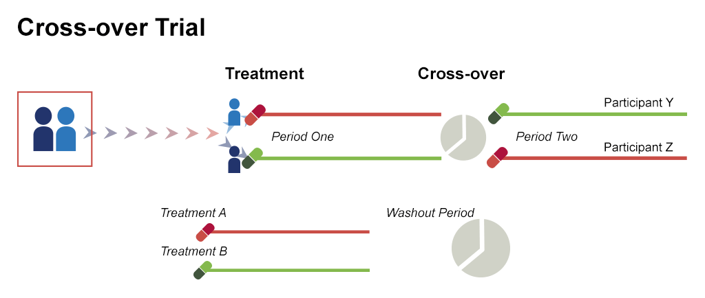
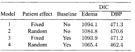
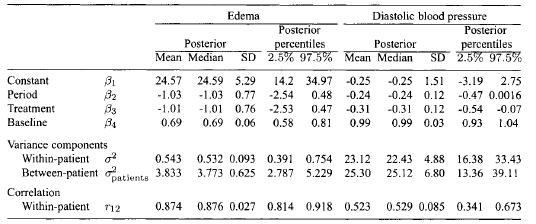
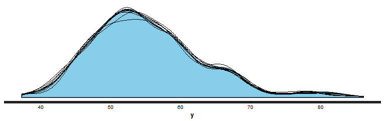
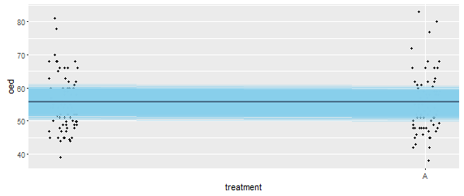
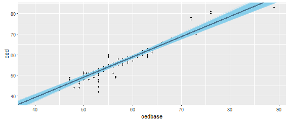

## Just Another Example: a simple crossover trial
- __Crossover trial:__ different treatments are given with different sequences in groups of patients

<center></center>
    

## Brown&Prescott (Applied Mixed Models in Medicine, 2006){.smaller}
    
- Comparison of two diuretics in the treatment of mild and moderate heart failure
- Baseline observation were taken before the first treatment period
- The duration of each treatment period was 5 days without any washout period
    - to avoid carryover effects, measurement of the first 2 days were ignored
- Two endpoint analyzed:
    - edema status (OED)
        - the sum of left and right ankle diameters
    - diastolic blood preassure (DBP)
        - the sum of 3 DBP readings
-  __Aim: compare the effectiveness of the two treatments__    

## Brown&Prescott (Applied Mixed Models in Medicine, 2006)

```{r, echo=FALSE, message=FALSE, warning=FALSE}

data <- read.table('R\\hrtfail_data.dat')
names(data) <- c('ID', 'Treatment','Period','OED_base','DBP_base','OED','DBP')
library(xtable)
print(xtable(data[1:11,], digits=0), type='html',  html.table.attributes = "border=0")

```

## Brown&Prescott (Applied Mixed Models in Medicine, 2006)

Four models were fitted for each response (OED and DBP) and compared using DIC:

- treatment and period effect were included in the analysis as fixed effects
- patient effect was included as either fixed or random effect
- baseline measures were introduced in two models to assess their importance
- an additional model with interaction effect between the period and the treatment to account for possible _carryover_ effects


## Models formulation

$$
\begin{eqnarray}
Y_i & \sim & N(\mu_i, \sigma^2) \\
\mu_i & = & \beta_1 + \beta_2\text{period}_i + \beta_3 T_i + \gamma_1 a^{\text{random}}_{P_i} + (1-\gamma_1) a^{\text{fixed}}_{P_i} + \gamma_2 \beta_4 B_i \\
a^{\text{random}}_{k} & \sim & N(0,\sigma^2_{\text{patients})
a^{\text{fixed}}_{k} & \sim & N(0,10^{-3})
\end{eqnarray}
$$

## Model 1: fixed effects + no baseline {.smaller}
```{r, eval=FALSE}

library(BRugs)

### specify model------------
modelstring="
model
{
  for (i in 1:N){
			# --------------------
  # model for oed
  # --------------------
  oed[i]~dnorm( mu.oed[i], tau.oed[1])
  mu.oed[i] <- b.oed[1] + b.oed[2] *(period[i]-1)+ b.oed[3] *(treatment[i]-1) + a.oed.fixed[ patient[i] ] 
  # --------------------
  # model for dbp
  # --------------------
  dbp[i]~dnorm( mu.dbp[i], tau.dbp[1])
  mu.dbp[i] <- b.dbp[1] + b.dbp[2] *(period[i]-1)+ b.dbp[3] *(treatment[i]-1) + a.dbp.fixed[ patient[i] ] 
  }
  for (i in 1:n){ 
  # [...]"
```


## Model 1: fixed effects + no baseline {.smaller}
```{r, eval=FALSE}

library(BRugs)

### specify model------------
[...]
  # 
  # Non-informative priors for individual/patients fixed effects		
  a.oed.fixed[i]~dnorm( 0.0, 0.001)
  a.dbp.fixed[i]~dnorm( 0.0, 0.001)
  }
  for (i in 1:p){
  b.oed[i]~dnorm( 0.0, 0.001)
  b.dbp[i]~dnorm( 0.0, 0.001)
  }
  tau.oed[1]~dgamma( 0.001,0.001)
  tau.dbp[1]~dgamma( 0.001,0.001)
  #
  #
  s2[1]<-1/tau.oed[1]
  s2[2]<-1/tau.dbp[1]
  
  for( i in 1:N ){
  res1[i] <- oed[i] - mu.oed[i]
  res2[i] <- dbp[i] - mu.dbp[i]
  }
  R[1] <- 1 - pow( sd(res1[1:N])/sd(oed[1:N]), 2)
  R[2] <- 1 - pow( sd(res2[1:N])/sd(dbp[1:N]), 2)
  
}

```


## Model 1: fixed effects + no baseline {.smaller}

```{r, eval=FALSE}


datalist <- list(N=nrow(crossover),
                 n = unique(length(crossover$patient)),
                 p = 3,
                 oed = crossover$oed,
                 dbp = crossover$dbp,
                 period = crossover$period,
                 treatment = crossover$treatment,
                 patient = crossover$patient)


modelData(bugsData( datalist))

```


## Model 1: fixed effects + no baseline {.smaller}
```{r, eval=FALSE}

# compile model----
modelCompile()

#inits-------------
inits1 <- list( b.oed=c(0,0,0), b.dbp=c(0,0,0), tau.oed=1, tau.dbp=1)
BRugs::bugsInits(list(inits1), numChains=1, fileName='inits1.txt')
modelInits('inits1.txt')
modelGenInits()

# bur-in------
modelUpdate(20000)     

# set parameters----
parameters <- c('tau.oed', 'tau.dbp', 'b.oed','b.dbp')
samplesSet(parameters)     
dicSet()

# model update--------
modelUpdate(50000)     


```


## Model 2: random effects + no baseline {.smaller}

- Model2.R

## Model 3: fixed effects + baseline {.smaller}

- Model3.R

## Model 4: random effects + baseline {.smaller}

- Model4.R

## DIC to choose models

 <center></center>

- To check for deviations from the normality assumption, the log-normal distribution can be used (higher DIC values)

## DIC: computational note {.smaller}

For a hierarchical model with the structure
$$
\begin{array}{rl}
Y_i \vert u_i &\sim& f(y_i\vert u_i, \boldsymbol\theta)\\
u_i &\sim& f(u_i\vert \boldsymbol\theta_u)\\
\end{array}
$$
DIC is computed using deviance measure
$$
D_c(\mathbf u, \boldsymbol \theta) = -2\log f(\mathbf y\vert \mathbf u, \boldsymbol \theta)
$$
based on the conditional likelihood
$$
f(\mathbf y\vert \mathbf u, \boldsymbol \theta) = \prod_{i=1}^n
 f(y_i\vert u_i,\boldsymbol \theta)
$$

DIC is given by
$$
\text{DIC} = 2\overline{D_c(\mathbf u, \boldsymbol \theta)}-D_c(\bar{\mathbf u}, \bar{\boldsymbol \theta})
$$

## DIC: computational note

When model is fitted directly
$$
Y_i \sim f(y_i\vert \boldsymbol \theta, \boldsymbol \theta_u)
$$
based on the marginal distribution
$$
f(Y_i\vert \boldsymbol \theta, \boldsymbol \theta_u) = \int f(Y_i\vert\boldsymbol \theta, u_i) f(u_i\vert\boldsymbol \theta_u)du_i
$$
the DIC is given by
$$
\text{DIC} = 2\overline{D(\boldsymbol \theta, \boldsymbol \theta_u)}-D(\bar{\boldsymbol\theta}, \bar{\boldsymbol \theta}_u)
$$
with
$$
D(\boldsymbol\theta, \boldsymbol \theta_u) = -2\sum_{i=1}^n \log f(Y_i\vert\boldsymbol\theta, \boldsymbol \theta_u)
$$

## Final Model


 <center></center>

    
## Stan
 
```{r, eval=FALSE}

library(rstanarm)

data <- read.csv('R\\crossover.base.csv')
data$period <- data$period-1
data$treatment <- data$treatment-1

post2 <- stan_lmer(oed ~ period + treatment + oedbase+ (1|patient), data=data)

```


## Stan
```{r, eval=FALSE}
pp_check(post1)

```

 <center></center>


## Stan
```{r, eval=FALSE}

library(ggplot2)

base <- ggplot(data, aes(x = treatment, y = oed)) +
  geom_point(size=1, position=position_jitter(height = 0.05, width = 0.1)) +
  scale_x_continuous(breaks = c(1,2), labels = c('A', 'B')) 

draws <- as.data.frame(post2)[,1:3]
draws <- na.omit(draws)
colnames(draws)[1] ='intercept'
base + 
  geom_abline(data = draws, aes(intercept = intercept +mean(data$oedbase), slope = treatment),
              color = 'skyblue', size = 0.2, alpha = 0.25) +
  geom_abline(intercept = fixef(post2)[1] + mean(data$oedbase), slope = fixef(post2)[3],
              color = 'skyblue4', size = 1)
```


## Stan

<center></center>


## Stan: relationship with baseline

```{r, eval=FALSE}
draws <- as.data.frame(as.matrix(post2))
colnames(draws)[1] <- "intercept"
ggplot(data, aes(x = oedbase, y = oed)) + 
  geom_point(size = 1) +
  geom_abline(data = draws, aes(intercept = intercept, slope = oedbase), 
              color = "skyblue", size = 0.2, alpha = 0.25) + 
  geom_abline(intercept = fixef(post2)[1], slope = fixef(post2)[4], 
              color = "skyblue4", size = 1)
```


## Stan: relationship with baseline

<center></center>

## The carry-over effect?

- Try to add an interaction term between the period and the treatment

- It is worth modeling the carry-over effect?


## Getting the slides

* The slides for this course were created with Rmarkdown: [http://rmarkdown.rstudio.com/](http://rmarkdown.rstudio.com/). 
* They are available from [https://github.com/berkeley3/BDA](https://github.com/berkeley3/BDA).
* To re-compile the slides:

    + Download the directory containing the lectures from Github
    + In R open the .Rmd file and set the working directory to the lecture directory
    + Click the *KnitHTML* button on Rstudio or run the following commands: 
  
```{r RmarkdownChunk, eval=FALSE}
library(rmarkdown) 
render("main.Rmd")
