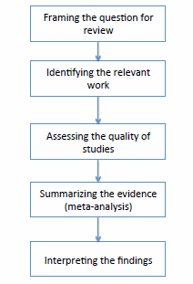
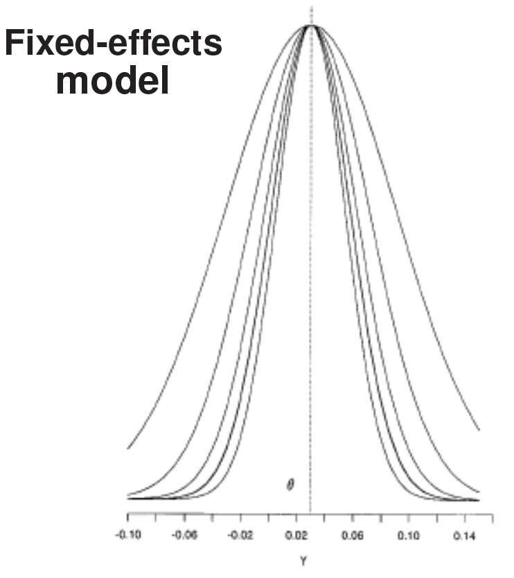
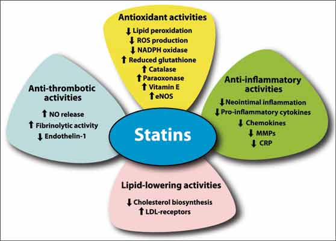
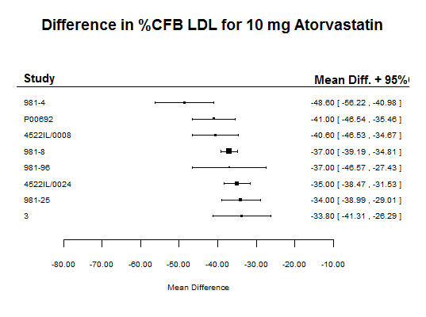

<style>
  .col2 {
    columns: 2 200px;         /* number of columns and width in pixels*/
    -webkit-columns: 2 200px; /* chrome, safari */
    -moz-columns: 2 200px;    /* firefox */
  }
  .col3 {
    columns: 3 100px;
    -webkit-columns: 3 100px;
    -moz-columns: 3 100px;
  }
</style>

## What a meta-analysis is

- Quantitative review and synthesis of results from related butindependent studies 

- Aggregate data (AD) meta-analysis
    - Based on summary statistics from each trial
    - Mean response, proportion of responders
    - Mean difference between groups, odds ratio, hazard ratio
- Individual patient data (IPD) meta-analysis
    - Observed response, time-to-event
- If data are collected longitudinally, either approach can be applied at a single time point or as a longitudinal model
    - IPD is better suited for longitudinal models than AD

## In contrast: systematic review

- A (qualitative) summary of literature related to a specific set of research objectives

- Systematic reviews include a quantitative summary of the literature 
    - a meta-analysis

- Cochrane Collaboration Handbook lists guidelines for performing a systematic review and meta-analysis

- The PRISMA statement provides standards for reporting systematic review and meta-analyses


## Steps for performing a meta-analysis

<center></center>


## Sources of variation
- Sampling error
    - Large studies typically provide more precise estimates than small studies 
- Study-level characteristics
    - Will consider these as ways to explain differences in treatment
effects across studies through covariates (meta-regression)
  Inter-study variation
    - The remaining, unexplained, variability in treatment effects across studies


## Statistical models

- Fixed effects models
    - Each study is measuring the same underlying parameter
    - There is no inter-study variation in treatment effect (after possibly accounting for covariate effects)
    - After accounting for covariates, the only source of variation is sampling error
- Random effects models
    - Each study is associated with a different, but related, underlying parameter
    - After accounting for covariates, there is still some unexplained inter-study variability in addition to sampling error
    
## 5 hypothetical study under fixed and random effects models {.smaller}

<div class="col2">
<center></center>
Each study provides an estimate of the
common mean effect $(\theta)$. They differ only
in how well each study sample estimates $\theta$

<center></center>
Each study-level effect is drawn from a
"superpopulation" with mean $\theta$. Estimates
from individual studies are centered
around these.
</div>

## The simple fixed effects model 

-  Suppose there are r independent studies, each comparing the treatment group with the control group
    - $\theta$ denotes the measure of treatment difference
    - $\hat{\theta}_i$ its estimate from the $i$-th study
- The general fixed effects model is
$$
\hat{\theta}_i = \theta + \epsilon_i
$$
with $E(\epsilon_i)=0$ and $Var(\epsilon_i)=s_i^2$

- Usually $Var(\epsilon_i)$ is treated as known and equal to the estimated variance of $\hat{\theta}_i$
$$
\theta_i \sim N(\theta, s^2_i)
$$

## Just for fun let's show the MLE {.smaller}
- The log likelihood for $\theta$ is
$$
l(\theta)= \sum_{i=1}^r -\frac{1}{2}\log(s_i^2) - \frac{1}{2}\frac{\left(\hat{\theta}_i - \theta \right)^2}{s_i^2}
$$

- Differentiating the log-likelihood with respect to $\theta$
$$
\frac{\partial l(\theta)}{\partial\theta} =  \sum_{i=1}^r \frac{\left(\hat{\theta}_i - \theta \right)^2}{s_i^2}
$$

- Setting the derivative equal to 0 and solving for $\theta$
$$
\sum_{i=1}^r \frac{\hat{\theta}_i}{s_i^2} = \hat{\theta}_{FE} \sum_{i=1}^r \frac{1}{s_i^2} \Longrightarrow \hat{\theta}_{FE} = \frac{\sum_{i=1}^r \frac{\hat{\theta}_i}{s_i^2}}{\sum_{i=1}^r \frac{1}{s_i^2} }
$$

$$
\hat{\theta}_{FE} = 
\frac{\sum_{i=1}^r w_i\hat{\theta}_i}{\sum_{i=1}^r w_i} \quad \text{with } w_i = \frac{1}{s_i^2}
$$

## Conjugate Bayesian analysis
- If we use a normal prior distribution for $\theta$ then the posterior distribution for is also a normal distribution
$$
\begin{eqnarray}
 \theta_i\vert\theta &\sim & N(\theta, s_i^2)\\
\theta &\sim & N(\mu,\sigma^2)\\
 & \downarrow & \\
\theta\vert\text{data}  &\sim & N(\mu_{post},\sigma^2_{post})
 \end{eqnarray}
$$
where
$$
\begin{eqnarray}
 \mu_{post} &=& \frac{\sum_{i=1}^r w_i\hat{\theta}_i + \mu/\sigma^2}{\sum_{i=1}^r w_i + \sigma^{-2}}\\
\sigma^2_{post} &= & \left(\sum_{i=1}^r w_i + \sigma^{-2}\right)^{-1}\\
\end{eqnarray}
$$


## Just for fun

- If the prior distribution is non-informative
    - $\sigma^2$ is large relative tu $\mu$ and $\sum w_i$
    - $\mu/\sigma^2 \approx 0$ and $\sigma^{-2}\approx 0$

$$
\mu_{post} \approx \hat{\theta}_{FE}
$$

and

$$
\sigma^2_{post} \approx \text{Var}(\hat{\theta}_{FE})
$$


## The simple random effects model
Let $\theta$ denotes the measure of treatment difference and 
$\hat \theta_i$ its estimate from the $i-th$ study.
Then the general random effects model is
$$
\hat\theta_i = \theta_i + \epsilon_i \qquad \theta_i\sim N(\theta, \tau^2)
$$

## The Bayesian random effects meta-analysis model

- For the Bayesian model, we add one more level to the hierarchical
model - prior distributions for $\theta$ and $\tau^2$

- The general Bayesian random effects model is
\begin{equation*}
\begin{array}{cr}
\hat{\theta_i}\vert\theta_i, s_i^2 \sim N(\theta_i, s_i^2)  &\hfill\text{data model}\\
\theta_i\vert\theta, \tau^2 \sim N(\theta, \tau^2) & \hfill\text{study-level parameter model}\\
\theta\sim f \quad \tau^2\sim g & \hfill \text{prior distributions}\\
\end{array}
\end{equation*}

For example, $\theta\sim N(\mu, \sigma^2)$ and $\tau\sim U(0,a)$


## Example: comparing 10 mg Atorvastatin to placebo

- Atorvastatin is a member of the drug class known as statins, which are used primarily as a lipid-lowering agent and for prevention of events associated with cardiovascular disease.

<center></center>

## Example: 10 mg Atorvastatin vs placebo


<center></center>


## Example: 10 mg Atorvastatin vs placebo

- The variables of interest are ldlPcfb (mean percent change from baseline LDL) and seLdlPcfb (the associated standard error). 
- The corresponding sample size in in the variable n.
- Open script atorvastatin.R


## Look at convergence diagnostics

- Parameter inference from posterior samples is only valid when the MCMC chains, associated with the
given parameter of interest, have converged. 

- Gelman and Rubin (1992) provides a detailed discussion on convergence diagnostics. 

- At least check if the chains are mixing assuming dispersed starting values were used to initialize the chains
    - using the trace plots
    - the Gelman-Rubin diagnostic (Gelman and Rubin 1992). 
    

## Gelman-Rubin diagnostic     

- Gelman-Rubin diagnostic measures if  there is a significant difference between the _variance within_ several chains and the _variance between_ several chains by the potential scale reduction factors. 
- Convergence is diagnosed when the chains have _forgotten_ their initial values
    - the output from all chains is indistinguishable. 

- It gives the scale reduction factors for each parameter. 
    - A factor of 1 means that _between chain variance_ and _within chain variance_ are equal 
    - larger values mean that there is still a difference between chains.
    
- A rule of thumb is that values of 1.1 and less suggests adequate convergence. 

## Help yourself

- The dataset __CochranePancreaticData12months.csv__ presents 12 month mortality data from 15 controlled clinical comparing
gemcitabine+chemotherapy (GC) with gemcitabine (G) with in pancreatic
cancer (Yip et al. 2006). 

- The variables of interest are 
    - d.GC (# deaths on GC) and d.G (# deaths on G)
    - N.GC (# randomized to GC) and N.G (# randomized to G). 
$$
OR = \frac{d.GC\times (N.G-d.G)}{(N.GC-d.GC)\times d.G}
$$

$$
\text{Var}(\log OR) = \frac{1}{d.GC} + \frac{1}{N.GC-d.GC} + \frac{1}{d.G} + \frac{1}{N.G-d.G}
$$    

## Help yourself

1. Read the data, derive the log odds ratio comparing GC to G and corresponding standard error.
2. Make a forest plot of the log odds ratio values. 
3. Fit a random effects model
4. Using the forest and addpoly functions, make a forest plot overlaying the data and the random effects estimate of the odds ratio.

$$
OR = \frac{d.GC\times (N.G-d.G)}{(N.GC-d.GC)\times d.G}
$$

$$
\text{Var}(\log OR) = \frac{1}{d.GC} + \frac{1}{N.GC-d.GC} + \frac{1}{d.G} + \frac{1}{N.G-d.G}
$$

## References 

- Borenstein, Hedges, Higgins and Rothstein. Introduction to Meta-Analysis. John Wiley & Sons. 2009.

- Whitehead A. Meta-Analysis of Controlled Clinical Trials, John Wiley & Sons: West Sussex. 2002.

- Sharon-Lise T. Normand. Meta-analysis: Formulating, evaluating, combining and reporting. Statistics in Medicine 18, 321-359. 1999

- Khan KS, Kunz R, Kleijnen J, and Antes G. Five steps to conducting a systematic review. J R Soc Med. 2003 96(3):118-121.

- Gelman A and Rubin DB. Inference from iterative simulation using multiple sequences. Statistical Science (1992): 457-472.

## Getting the slides

* The slides for this course were created with Rmarkdown: [http://rmarkdown.rstudio.com/](http://rmarkdown.rstudio.com/). 
* They are available from [https://github.com/berkeley3/BDA](https://github.com/berkeley3/BDA).
* To re-compile the slides:

    + Download the directory containing the lectures from Github
    + In R open the .Rmd file and set the working directory to the lecture directory
    + Click the *KnitHTML* button on Rstudio or run the following commands: 
  
```{r RmarkdownChunk, eval=FALSE}
library(rmarkdown) 
render("main.Rmd")