<style>
  .col2 {
    columns: 2 200px;         /* number of columns and width in pixels*/
    -webkit-columns: 2 200px; /* chrome, safari */
    -moz-columns: 2 200px;    /* firefox */
  }
</style>

## The Metropolis Arcipelago

 <center>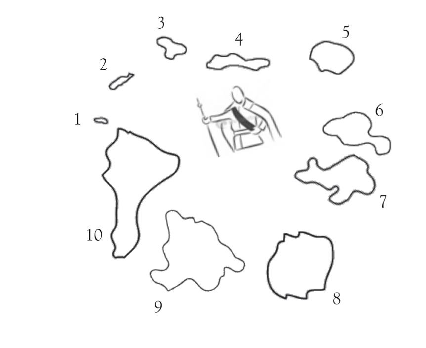</center>
 
- visiting each island in proportion to its population size 

## The Metropolis Arcipelago

- choose a starting point 

 <center>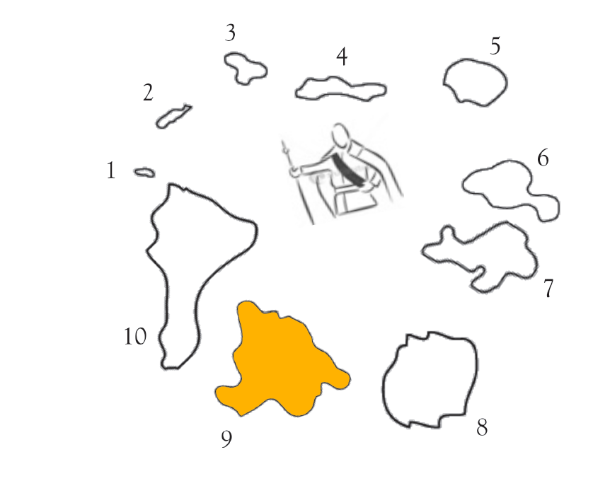</center>
 
## The Metropolis Arcipelago

- flip a coin to choose island on left or right: the __proposal island__
    
 <center>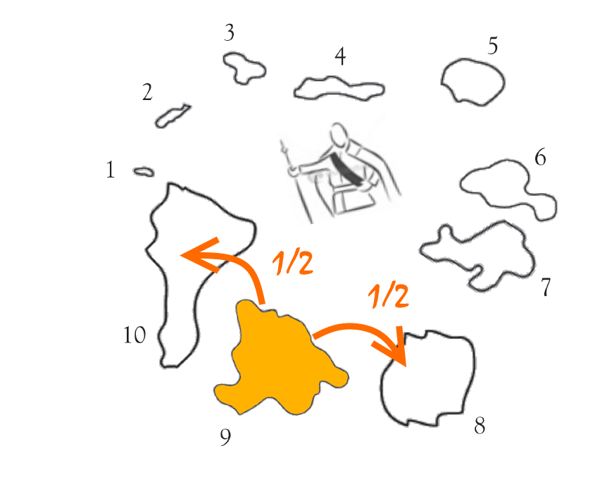</center>
 
## The Metropolis Arcipelago

- Flip a coin to choose island on left or right: the __proposal island__
    
 <center>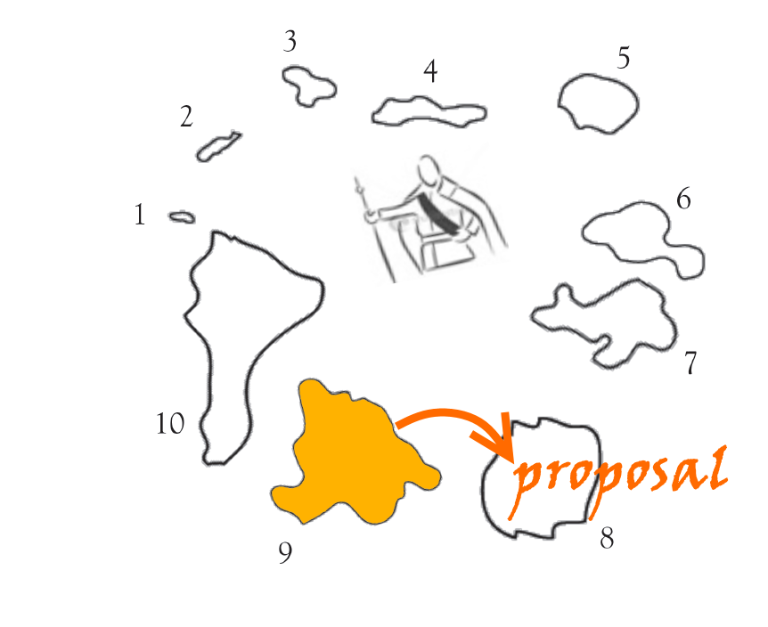</center>


## The Metropolis Arcipelago

- Find the population of the __proposal island__
    
 <center>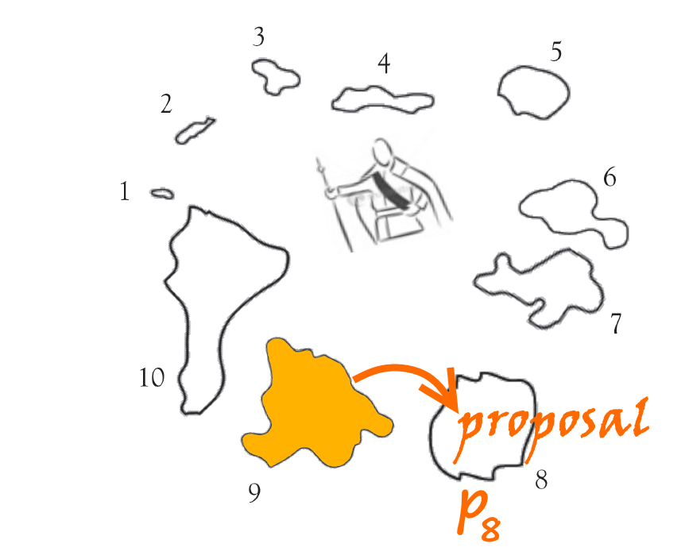</center>


## The Metropolis Arcipelago

- Find the population of the __current island__
    
 <center>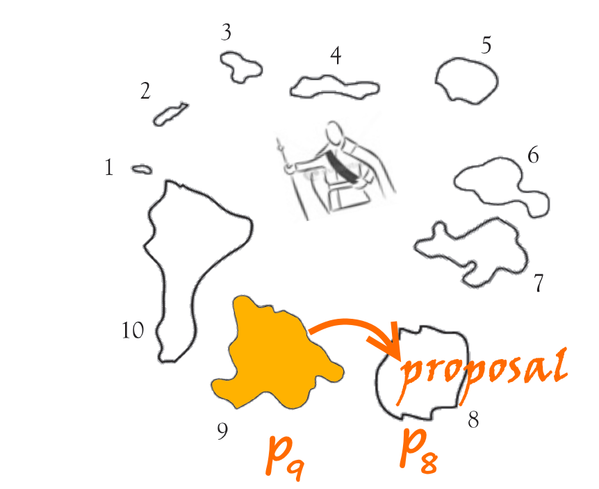</center>
 

## The Metropolis Arcipelago

- Move to __proposal__ with probability $p_8/p_9$
    
 <center></center>
 
## The Metropolis Arcipelago
<div class="col2">

1. Flip a coin to choose island on left or right: the __proposal island__
2. Find the population of the __proposal island__
3. Find the population of the __current island__
4. Move to __proposal__ with probability $p_8/p_9$
5. Repeat from 1
 
</div>

This procedure ensures visiting each island in proportion to its population in the _long run_
 
## Metropolis and MCMC

- Usual use is to draw samples from a posterior distribution
- _Islands:_ parameter values
- _Population size:_ proportional to posterior probability
- Works for any number of dimensions (parameters)
- Works for continuous as well as discrete parameters

## R code

```{r, eval=FALSE}
iterations <- 1000
positions <- rep(0, iterations)

for (i in 1:iterations){
  # record current position
  positions[i] <- current

  # flip a coin to generate proposal
  proposal <- current + sample(c(-1,1), size=1)
  
  # make sure you are not outside the parameter region
  if(proposal<1) proposal <- 10
  if(proposal>10) proposal <- 1
  
  # make decision about moving
  prob.move <- proposal/current
  current <- ifelse(runif(1) < prob.move, proposal, current)
  }
```


## Markov's chain of visits

```{r, echo=FALSE, fig.align='center'}

iterations <- 1000
positions <- rep(0, iterations)
current <- 5

for (i in 1:iterations){
  # record current position
  positions[i] <- current

  # flip a coin to generate proposal
  proposal <- current + sample(c(-1,1), size=1)
  
  # make sure you are not outside the parameter region
  if(proposal<1) proposal <- 10
  if(proposal>10) proposal <- 1
  
  # make decision about moving
  prob.move <- proposal/current
  current <- ifelse(runif(1) < prob.move, proposal, current)
  }

plot(1:iterations, positions, xlab='iteration', ylab='island', col='skyblue2')
```


## Markov's chain of visits

```{r mcmc, echo=FALSE, fig.align='center'}

iterations <- 10000
positions <- rep(0, iterations)
current <- 5

for (i in 1:iterations){
  # record current position
  positions[i] <- current

  # flip a coin to generate proposal
  proposal <- current + sample(c(-1,1), size=1)
  
  # make sure you are not outside the parameter region
  if(proposal<1) proposal <- 10
  if(proposal>10) proposal <- 1
  
  # make decision about moving
  prob.move <- proposal/current
  current <- ifelse(runif(1) < prob.move, proposal, current)
}

nf <- layout(matrix(c(1,1,1,2,3,4), 2, 3, byrow = TRUE), respect = TRUE)
plot(1:iterations, positions, xlab='iteration', type='l', ylab='island', col='skyblue2')
plot(1:10, as.numeric(table(positions[1:100])), ylab='nr of visits', type='h', xlab='island', col='skyblue4')
plot(1:10, as.numeric(table(positions[1:500])), ylab='nr of visits', type='h', xlab='island', col='skyblue4')
plot(1:10, as.numeric(table(positions[1:2000])), ylab='nr of visits', type='h', xlab='island', col='skyblue4')
```


## The Metropolis Algorithm

```{r, echo=FALSE, eval=FALSE}
# population level parameters
mu <- 7
sigma <- 3

# collect some data (e.g. a sample of heights)
n <- 50
x <- rnorm(n, mu, sigma)

# log-likelihood function
ll <- function(x, muhat, sigmahat){
  sum(dnorm(x, muhat, sigmahat, log=T))
}

# prior densities
pmu <- function(mu){
  dnorm(mu, 0, 100, log=T)
}

psigma <- function(sigma){
  dunif(sigma, 0, 10, log=T)
}

# posterior density function (log scale)
post <- function(x, mu, sigma){
  ll(x, mu, sigma) + pmu(mu) + psigma(sigma)
}

geninits <- function(){
  list(mu = runif(1, 4, 10),
       sigma = runif(1, 2, 6))
}

jump <- function(x, dist = .1){ # must be symmetric
  x + rnorm(1, 0, dist)
}

iter = 10000
chains <- 3
posterior <- array(dim = c(chains, 2, iter))
accepted <- array(dim=c(chains, iter - 1))

for (c in 1:chains){
  theta.post <- array(dim=c(2, iter))
  inits <- geninits()
  theta.post[1, 1] <- inits$mu
  theta.post[2, 1] <- inits$sigma
  for (t in 2:iter){
    # theta_star = proposed next values for parameters
    theta_star <- c(jump(theta.post[1, t-1]), jump(theta.post[2, t-1]))
    pstar <- post(x, mu = theta_star[1], sigma = theta_star[2])
    pprev <- post(x, mu = theta.post[1, t-1], sigma = theta.post[2, t-1])
    lr <- pstar - pprev
    r <- exp(lr)

    # theta_star is accepted if posterior density is higher w/ theta_star
    # if posterior density is not higher, it is accepted with probability r
    # else theta does not change from time t-1 to t
    accept <- rbinom(1, 1, prob = min(r, 1))
    accepted[c, t - 1] <- accept
    if (accept == 1){
      theta.post[, t] <- theta_star
    } else {
      theta.post[, t] <- theta.post[, t-1]
    }
  }
  posterior[c, , ] <- theta.post
}
```


```{r, echo=FALSE, eval=FALSE}

require(sm)
seq1 <- seq(1, 300, by=5)
seq2 <- seq(300, 500, by=10)
seq3 <- seq(500, iter, by=300)
sequence <- c(seq1, seq2, seq3)
length(sequence)

xlims <- c(4, 10)
ylims <- c(1, 6)

dir.create("metropolis_ex")
setwd("metropolis_ex")

ani.options(convert = 'C:\\Program Files\\ImageMagick-7.0.1-Q16\\convert.exe')
saveGIF({
  for(i in sequence){
    par(mfrow=c(1, 2))
    plot(posterior[1, 1, 1:i], posterior[1, 2, 1:i],
         type="l", xlim=xlims, ylim=ylims, col="blue",
         xlab="mu", ylab="sigma", main="Markov chains")
    lines(posterior[2, 1, 1:i], posterior[2, 2, 1:i],
          col="purple")
    lines(posterior[3, 1, 1:i], posterior[3, 2, 1:i],
          col="red")
    text(x=7, y=1.2, paste("Iteration ", i), cex=1.5)
    sm.density(x=cbind(c(posterior[, 1, 1:i]), c(posterior[, 2, 1:i])),
               xlab="mu", ylab="sigma",
               zlab="", zlim=c(0, .7),
               xlim=xlims, ylim=ylims, col="white")
    title("Posterior density")
  }
  }, interval=0.25
)
```

 <center>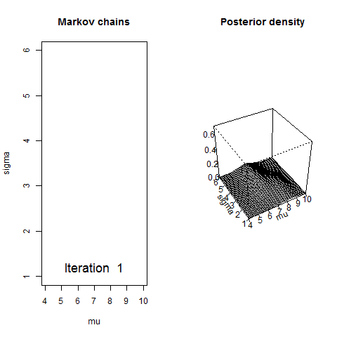</center>

- Metropolis algorithm requires symmetrical proposals
- __Metropolis-Hastings (MH)__ does not

## Metropolis and MCMC

- Metropolis: Simple version of Markov chain Monte Carlo (MCMC)
- Metropolis, Rosenbluth, Rosenbluth, Teller, and Teller (1953)

 <center>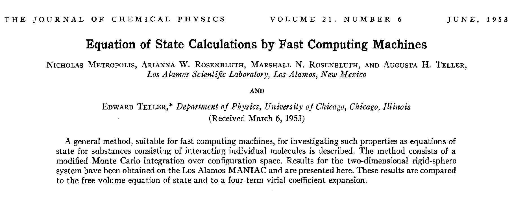</center>

## MANIAC

- _Mathematical Analyzer, Numerical Integrator, and Computer_

<div class="col2">

 

- __MANIAC__
    - 450 kg
    - 5 kilobytes of memory
    - 70k multiplications/sec

- __my laptop__
    - 1.2 kg
    - 16 million kilobytes
    - Billions of multiplications/sec

</div>

## Metropolis and MCMC

<div class="col2">

- Metropolis: Simple version of Markov chain Monte Carlo (MCMC)
- Chain: Sequence of draws from distribution
- Markov chain: History doesn't matter, just where you are now
- Monte Carlo: Random simulation

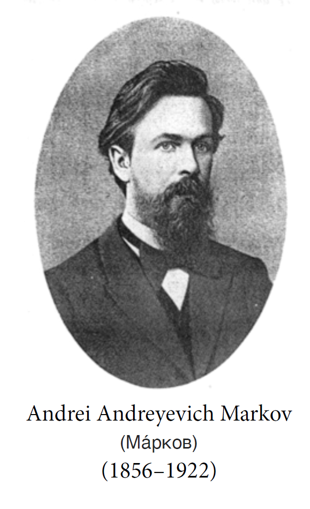

</div>

## Why MCMC

- Real value of MCMC seen when an integrated likelihood function cannot be written
- Many kinds of problems are like this:
    - Many multilevel models
    - Networks/phylogenies
    - Some spatial models
    
## MCMC Strategies

<div class="col2">

- __Metropolis:__ Granddaddy of all MCMC algorithms
- __Metropolis-Hastings (MH):__ More general
- __Gibbs sampling (GS):__ Efficient version of MH
- __Hamiltonian Monte Carlo (HMC)__
- All remain useful
- New methods being developed

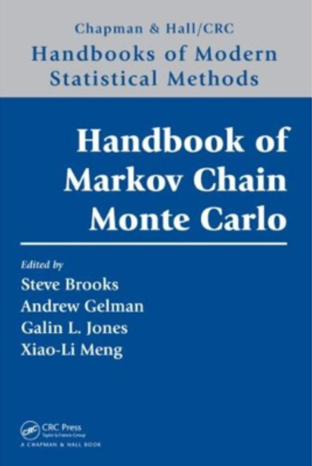

</div>

## Gibbs sampling

- Version of __MH__ with very clever proposals
    - requires choosing certain kinds of priors, conjugate
    - Basis of BUGS, JAGS

<center>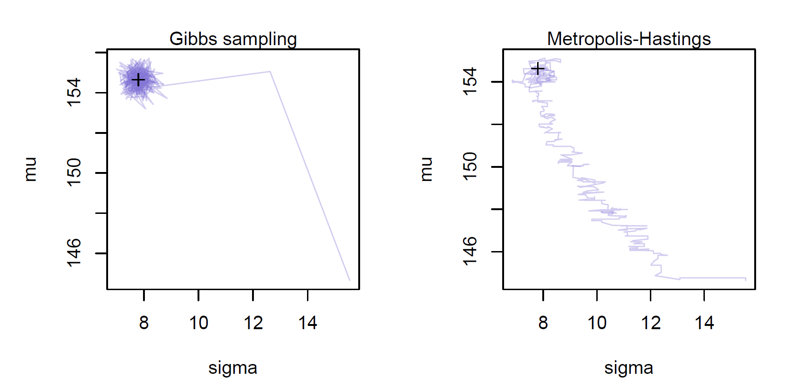</center>


## Hamiltonian Monte Carlo

<div class="col2">

- Problem with Gibbs sampling (GS)
    - Models with many parameters usually have lots of highly correlated parameters
    - GS gets stuck, degenerates towards random walk
    - At best, inefficient because re-explores regions

- Hamiltonian dynamics to the rescue
    - it represents parameter state as particle in $n$-dimensional space
    - flick it around frictionless log-posterior
    - record positions

<center> </center>

</div>

## King Monty's Kingdom


<center>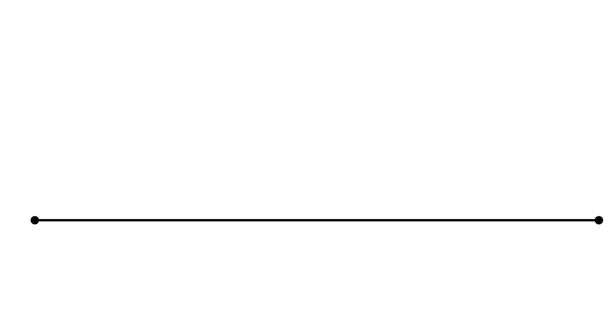</center>

## King Monty's Kingdom

<center>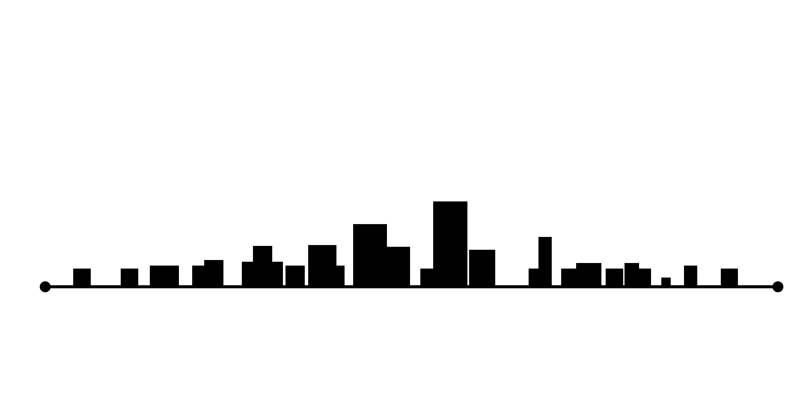</center>

## King Monty's Kingdom

<center>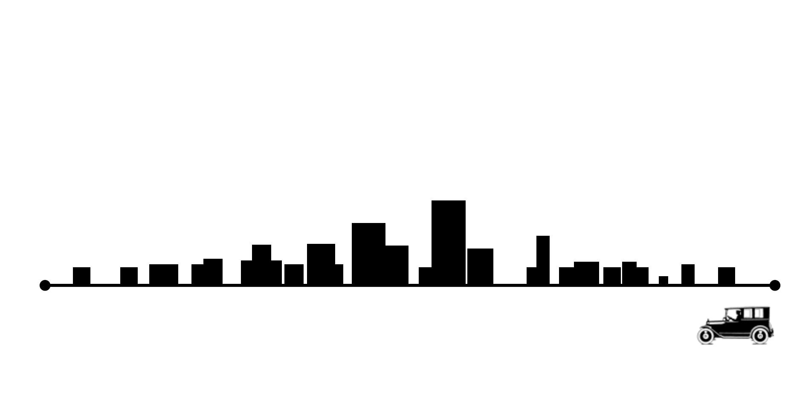</center>

## King Monty's Kingdom

<center>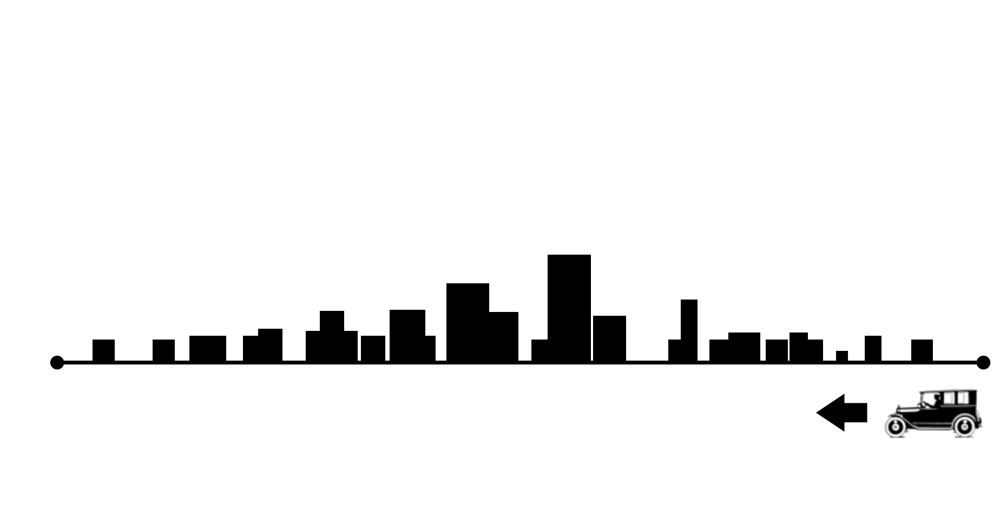</center>

## King Monty's Kingdom

<center>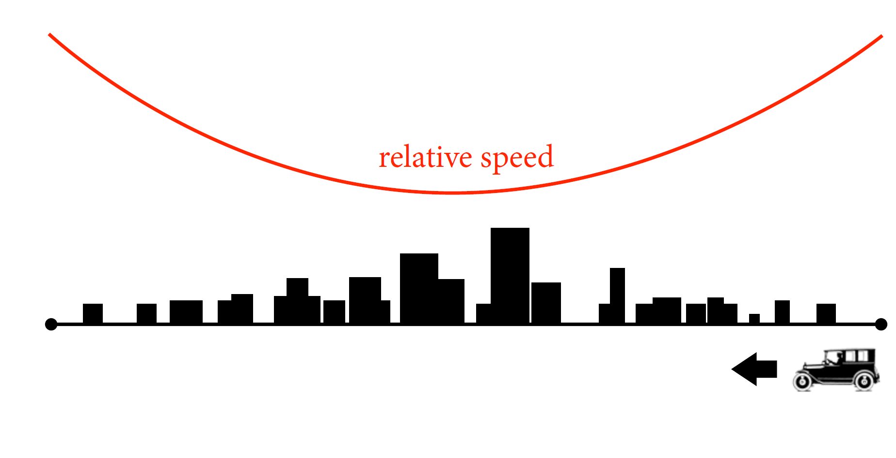</center>

## King Monty's Kingdom

<center>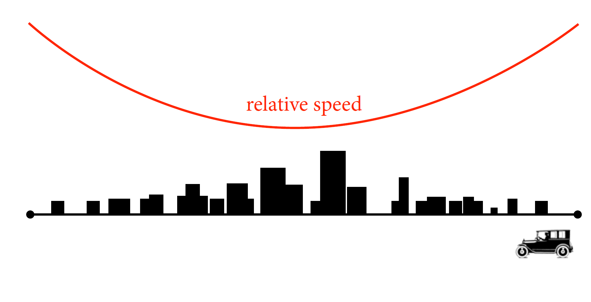</center>

## King Monty's Kingdom

<center>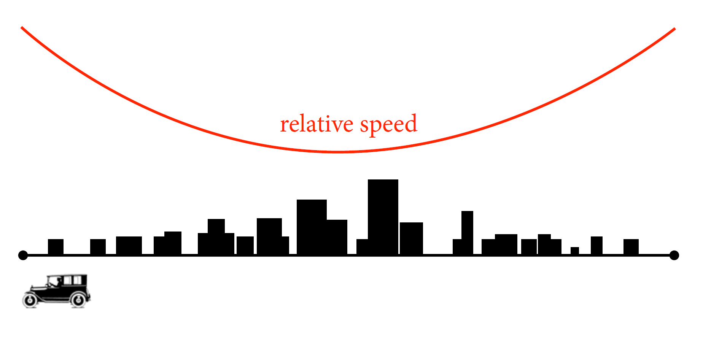</center>

## King Monty's Kingdom

<center></center>


## Hmiltonian Monte Carlo

<center>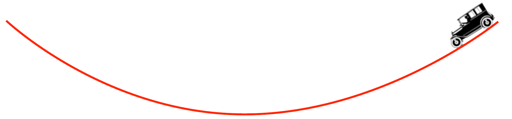</center>

- Population density curve: log-posterior
- Position of car: parameter vector
- Speed of car: momentum of parameter values
    - Go fast when high
    - Go slow when low
    - Samples of position through time comprise samples from
posterior distribution

## Gibbs vs Hamiltonian MCMC

<center>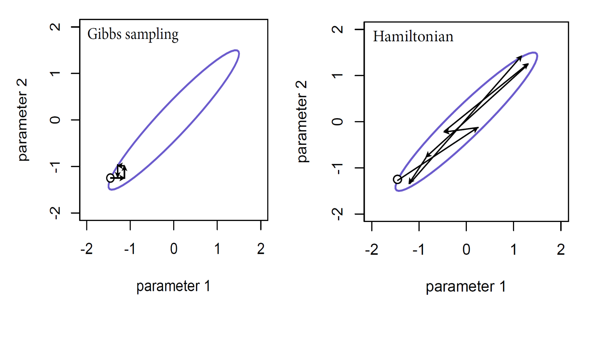</center>


## Gibbs vs Hamiltonian MCMC

<center>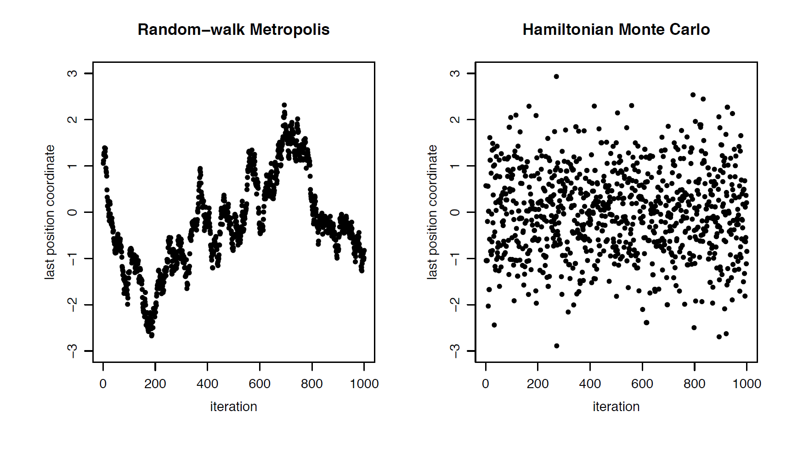</center>


## Stan

<div class="col2">


</div>


## Stan is NUTS


- No U-Turn Sampler (NUTS): Adaptive Hamiltonian Monte Carlo
- Implemented in Stan (rstan: mc-stan.org)

<center>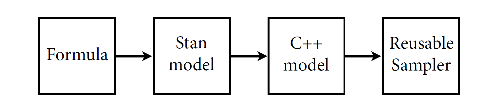</center>
<center></center>

## HMC Estimates

```{r, eval=FALSE}

library(rstanarm)

post2 <- stan_lmer(oed ~ period + treatment + oedbase+ (1|patient), data=data)
posterior_interval(post2, prob=0.95)

```

<table border=0>
<tr> <th>  </th> <th> 2.5% </th> <th> 97.5% </th>  </tr>
  <tr> <td align="right"> (Intercept) </td> <td align="right"> -3.03 </td> <td align="right"> 2.77 </td> </tr>
  <tr> <td align="right"> period </td> <td align="right"> -0.48 </td> <td align="right"> 0.00 </td> </tr>
  <tr> <td align="right"> treatment </td> <td align="right"> -0.55 </td> <td align="right"> -0.06 </td> </tr>
  <tr> <td align="right"> oedbase </td> <td align="right"> 0.93 </td> <td align="right"> 1.04 </td> </tr>
  <tr> <td align="right"> sigma </td> <td align="right"> 0.63 </td> <td align="right"> 0.89 </td> </tr>
   </table>

- $\sigma \sim \text{dcauchy}$


## HMC Estimates

<div class="col2">
One of many things named after Augustin-Louis Cauchy (KO-shee)

- Ratio of two Gaussian samples
- Useful distribution with thick tails
- Parameters: location of mode, scale
- Mean and variance undefined
- Related to Lévy flights

 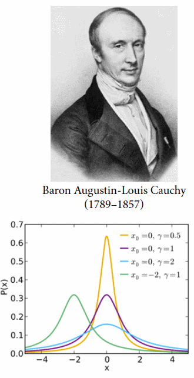
</div>


## HMC estimates

<center> 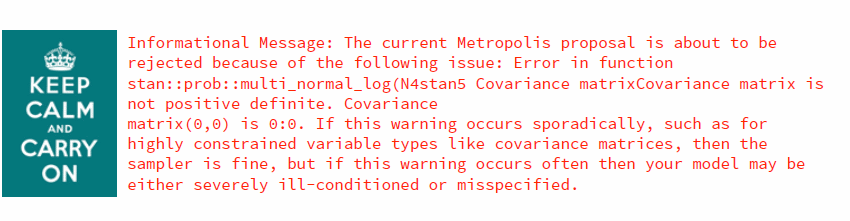</center>

- If it happens during wamup (adaptation), it is normal
- If it happens a lot after warmup, start worrying

## Check the chains

- First and most important check: trace plot
```{r, eval=FALSE}
plot(post2, "trace", regex_pars = 'treatment')
```

 <center>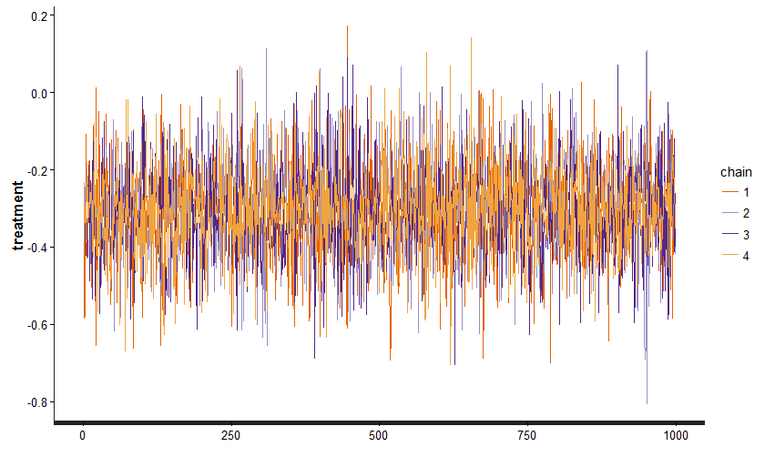</center>

## Warmup
 <center> 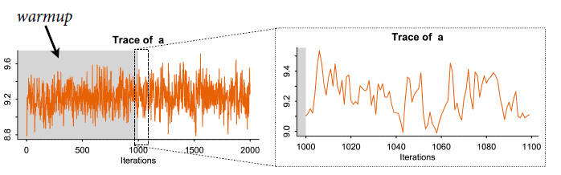</center>

- _Warmup_ is adaptation to posterior for efficient sampling
- Samples during wamup NOT from posterior
- Automatically discarded by precis/summary and other functions
- _Warmup_ is _not_ __burn in__
    - __burn in__ is front part of Markov chain using Gibbs or Metropolis
 
##  How to not get chained

 <center></center>

    
## Convergence diagnostics

```{r, eval=FALSE}
summary(post2)
```

|          | mcse | Rhat | n_eff |
|-----------|------|------|------|
|Treatment  |0.0   | 1.0  | 4000|
|oedbase    |0.0   | 1.0  | 588|

## How many samples?

- Use __warmup__ and __iter__ to control number of samples
- First run to get relaxed
    - $warmup = 1000$ and $iter = 2000$
- Advices
    - Enough warmup so mixing good, sampling efficient
    - Enough sampling for our purpose (n_eff)
      - _Means_: 200 usually enough
      - _99th percentile_: 20-thousan or more
    - Poorly mixing chains always require more samples
    
## How many chains?

- Use _chains_ to control number of chains
- First run: one chain to get relaxed
- Tune: multiple chains, to check convergence/stationary
- Final run: one chains is fine, more is processors to spare
- Good heuristic: 
    - 1 short
    - 4 medium
    - 2 long
  