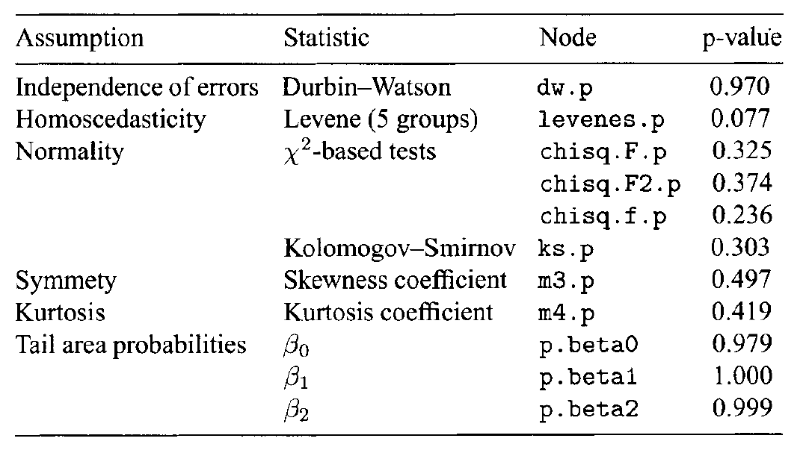
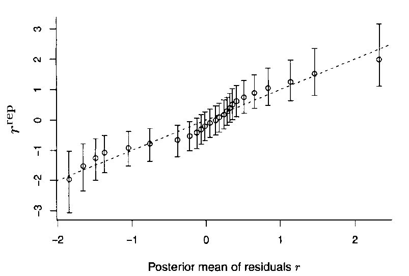
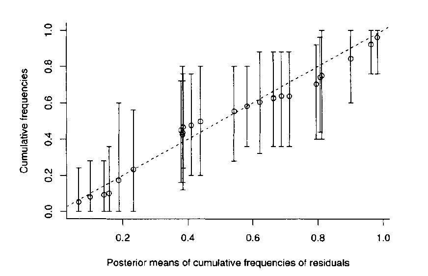
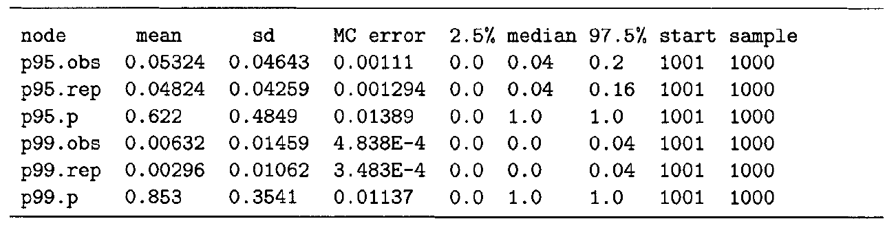
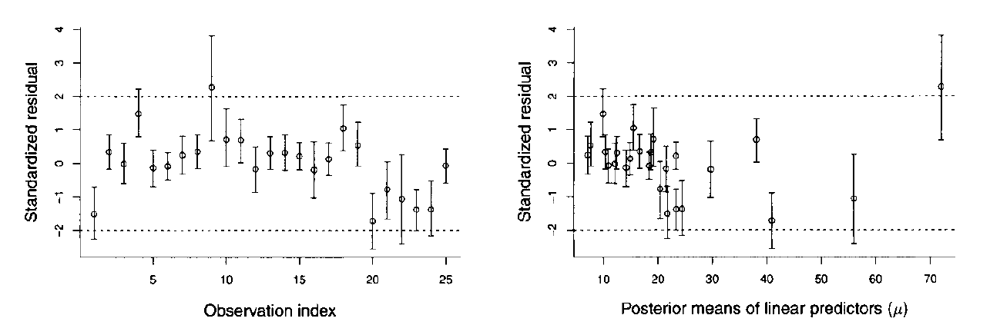
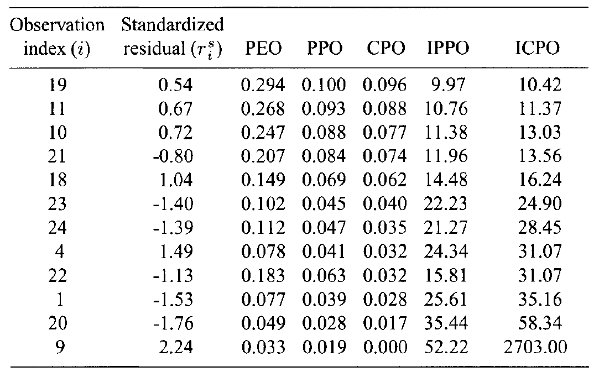

## Outline

- Predictive checks in normal ression models
- When fitting normal model, need to check for
    - the structural assumption of the model (independence, normality, homoscedasticity of errors)
    - possible outliers/observations that are rarely observed
    - the goodness-of-fit of the model

## Soft drinks data

```{r soft, echo=TRUE, results='asis', warning=FALSE, message=FALSE, echo=FALSE}
library(knitr)
library(xtable)
soft <- read.table('material\\softdrinks.dat', header = T)
print(kable(soft[1:5,], digits=0), type='html',  html.table.attributes = "border=0")

```

## Full model

```{r, eval=FALSE}

model{
    # model's likelihood
		for (i in 1:n){
		     time[i] ~ dnorm( mu[i], tau ) # stochastic componenent
		     # link and linear predictor
				 mu[i] <- beta0 + beta1 * cases[i] + beta2 * distance[i]   
		}
		# prior distributions
		tau ~ dgamma( 0.01, 0.01 )
    beta0 ~ dnorm( 0.0, 1.0E-4)
    beta1 ~ dnorm( 0.0, 1.0E-4)
    beta2 ~ dnorm( 0.0, 1.0E-4)
}

```

## Full model
```{r, eval=FALSE}

model{
   [...]
		# definition of sigma
		s2<-1/tau
		s <-sqrt(s2)
		# calculation of the sample variance
	  for (i in 1:n){ c.time[i]<-time[i]-mean(time[]) } 
		sy2 <- inprod( c.time[], c.time[] )/(n-1)
		# calculation of Bayesian version R squared
		R2B <- 1 - s2/sy2
		# Expected y for a typical delivery time
		typical.y <- beta0 + beta1 * mean(cases[]) + beta2 * mean(distance[])
		#
		# posterior probabilities of positive beta's
		p.beta0 <- step( beta0 )
		p.beta1 <- step( beta1 )
		p.beta2 <- step( beta2 )
}

```

## Data and Inits

```{r}

data <- list( n=25, 
      time = c(16.68, 11.5, 12.03, 14.88, 13.75, 18.11,  8, 17.83, 
               79.24, 21.5, 40.33, 21, 13.5, 19.75, 24, 29, 15.35, 
               19, 9.5, 35.1, 17.9, 52.32, 18.75, 19.83, 10.75), 
      distance = c(560, 220, 340, 80, 150, 330, 110, 210, 1460, 
                   605, 688, 215, 255, 462, 448, 776, 200, 132, 
                   36, 770, 140, 810, 450, 635, 150), 
      cases = c( 7, 3, 3, 4, 6, 7, 2, 7, 30, 5, 16, 10, 4, 6, 9, 
                10, 6, 7, 3, 17, 10, 26, 9, 8, 4) )

inits1 <- list( tau=1, beta0=1, beta1=0, beta2=0 )


```

## Posterior summaries {.smaller}

```{r postSumm, echo=FALSE, results='asis'}

dd <- data.frame(node=c('R2B', 'beta0','beta1','beta2','p.beta0','p.beta1','p.beta2','s', 'typical.y'), 
      mean=c(0.9511,2.356, 1.61, 0.01447,0.974,1.0,1.0,3.386,22.38),
      sd = c(0.01743, 1.188,0.1806,0.003812,0.1591,0.0,0.0,0.5695,0.683),
      MC_error = c('5.11E-4','0.03076','0.003737','8.47E-5','0.0040','2.23E-12','2.23E-12','0.0168','0.017'),
      Iperc = c(0.9064,-0.03996,1.272,0.0068,0.0,1.0,1.0,2.531,21.09),
      median=c(0.954,2.372,1.609,0.01446,1.0,1.0,1.0,3.302,22.37),
      II = c(0.9734,4.635,1.968,0.02211,1.0,1.0,1.0,4.749,23.78),
      start = rep(1001,9),
      sample = rep(2000,9)
    )
names(dd)[c(5,7)] <- c('2.5%','97.5%')
library(knitr)
library(xtable)
print(kable(dd), type='html',  html.table.attributes = "border=0")

```

## Model summaries

- Considering as point estimates the posterior means, the final model is
$$
Y = 2.36 + 1.6\times X_1 + 0.015\times X_2
$$

- Minor changes are observed in the regression equation if posterior medians are used as point estimates

- Both explanatory variables have an important contribution to the prediction of $Y$
    - all summary statistics and the posterior densities indicate that 0 is far away from the posterior distribution 
    - posterior probability of having positive association between each $X_j$ and $Y$ is equal to 1
    
## Model summaries

- The expected $Y$ is a posteriori expected to increase by 1.6
- The increase in expected $Y$ for each additional $X_1$ lies between 1.3 and 2.0 with probability 95%
- For every increase of $X_2$ by one unit, $Y$ is a posteriori expected to increase by 0.015, while every 100 additional units increases by 1.5 the posterior expected $Y$, ranging between 0.7 and 2.2 with probability 95%.
- Parameter $\beta_0$ has no sensible interpretation
    - the posterior probability of positive $\beta_0$ is equal to 97.4%


## Checking the structural assumptions of the model: independence

- Structural assumptions of the model are the independence of error, normality and homoscedasticity (constant variance across all observations)

- The independence of error can be checked using the Durbin-Watson statistic

$$
DW(\mathbf y) = \frac{\sum_{i=2}^n (r_i - r_{i-1})}{}
$$

which is essentially an estimate of the first oder autocorrelation of errors.

## Checking the structural assumptions of the model: normality

Normality can be checked using various version of $\chi^2$ and the KS statistics

- Testing for skewness and symmetry of the errors

- Calculating the number of observations with standardized residual values outside intervals
(-2, 2) and (-3, 3) and compared with the 5% and 1% expected under the normality assumption

## Checking the structural assumptions of the model: normality {.smaller}

- Visual evaluation of
    - 95% error bars of the cumulative frequencies $\hat{F}^{rep}$ of replicated/predictive values vs the observed cumulative frequency $\hat{F}_i$ for each residual value
    $$
    \hat{F}^{rep} = \frac{1}{n}\sum_{i=k}^n I(r_k^{rep}\leq r_i) \quad \text{and }
    \hat{F}_i = \frac{1}{n}\sum_{i=k}^n I(r_k\leq r_i)
    $$
    
    - 95% error bars of the ordered predictive standardized residual values $r_{(i)}^{rep}$ vs the poster means of ordered standardized residuals $r_{(i)}$

- These measures focus on different aspects of the fitted distribution and thus may identify different problems concerning the normality of errors

## Checking the structural assumptions of the model: homoscedasticity

Homoscedasticity of errors can be checked:
- dividing the sample into equal part on the basis of covariates or estimated mean in each iteration
- computing variances within each subsample
- comparing with the overall variance using the Levene test for the equality of variances
$$
W = \frac{(n-K) \sum_{i=1}^n (\bar{Z}_{gi} - \bar Z)^2}{(K-1) \sum_{i=1}^n (\bar{Z}_{i} - \bar Z_{gi})^2} \quad \text{with }  Z_i = \vert r_i - bar{r}_{gi}\vert
$$
where $r_i = y_i - \mu_i$ is the residual of the $i$-observation, $\bar r_g$ is the mean residual value for the $g$ group, $K$ is the number of subsamples, $\bar Z_g$ is the mean of the $g$th subsample and $g_i$ is the subsample indicator for the $i$-observation 


## Checking individual observations using residuals

Residual values are based on the deviations of the data from the mean of the model
$$
r_i = y_i - E(Y_i\vert\boldsymbol \theta)
$$
and its standardized version got by dividing it by the s.d. under the adopted model
$$
r_i^s = \frac{r_i}{SD(Y_i\vert\boldsymbol\theta)} = \frac{y_i - E(Y_i\vert\boldsymbol \theta)}{\sqrt{\text{Var}(Y-I\vert\boldsymbol\theta)}}
$$

- The tail area probability
$$
p_i^r = P(r_i^{rep} > r_i\vert\mathbf y) =  P(y_i^{rep} > y_i\vert\mathbf y) 
$$

## Checking individual observations using residuals

- The value
$$
min (p_i^r, 1-p_i^r) = min \left\{P(y_i^{rep} > y_i\vert\mathbf y), 1- P(y_i^{rep} > y_i\vert\mathbf y)  \right\}
$$
can be interpreted as the probability of _getting a more extreme observation_


## BUGS code

```{r, eval=FALSE}
#[...]
# residuals
		for ( i in 1:n ){
		     r[i]     <- (time[i] - mu[i])/s
		     y.rep[i] ~ dnorm( mu[i], tau )
		     r.rep[i] <- (y.rep[i] - mu[i])/s
         p.r[i]   <- step( time[i]-y.rep[i] )
         loglike[i] <- -0.5* log( 2*3.14 ) + 0.5*log(tau) -0.5 * pow(r[i],2)
				 ppo[i]   <- exp(loglike[i])
				 icpo[i]  <- 1/ppo[i]

```


## BUGS code {.smaller}

```{r, eval=FALSE}
## [...] #Chi-square statistics
for (i in 1:n){
         F2.obs[i] <- rank( r[], i )/n
         F2.rep[i] <- rank( r.rep[], i )/n
         F2.exp.obs[i] <- phi( r[i] )
         F2.exp.rep[i] <- phi( r.rep[i] )
         chisq.F2.obs.vec[i] <- pow(F2.obs[i]-F2.exp.obs[i],2)/(F2.exp.obs[i]*(1-F2.exp.obs[i]))
         chisq.F2.rep.vec[i] <- pow(F2.rep[i]-F2.exp.rep[i],2)/(F2.exp.rep[i]*(1-F2.exp.rep[i]))
     }
     # chisq values
     chisq.F2.obs <-  sum( chisq.F2.obs.vec[] )
     chisq.F2.rep <-  sum( chisq.F2.rep.vec[] )
     # chisq p-value     
     chisq.F2.p <- step( chisq.F2.rep - chisq.F2.obs )

     # KS statistic
          for (i in 1:n){ 
          F.diff.obs[i] <- abs( F2.obs[i] - F2.exp.obs[i] ) 
          F.diff.rep[i] <- abs( F2.rep[i] - F2.exp.rep[i] ) 
     }

     ks.obs <-  ranked(  F.diff.obs[], n )
     ks.rep <-  ranked(  F.diff.rep[], n )
     # chisq p-value     
     ks.p <- step( ks.rep - ks.obs )
   

```

## BUGS code {.smaller}

```{r, eval=FALSE}

# calculation of observed cumulative frequencies (for actual and replicated data)
     e <- 0.0001
     for (i in 1:n){
          ordered.y[i]     <- ranked( r[], i )
          ordered.y.rep[i] <- ranked( r.rep[], i )
     }

     for (i in 1:ncut){
          for (j in 1:n){
              bin.freq.obs[i,j] <- step( ycut[i]-ordered.y[j] )  
              bin.freq.rep[i,j] <- step( ycut[i]-ordered.y.rep[j] )  
          }
          F.obs[i] <- sum( bin.freq.obs[i,1:n] )/n
          F.rep[i] <- sum( bin.freq.rep[i,1:n] )/n
          F.exp[i] <- phi( ycut[i] )  
     }
     #
     # calculation of frequencies values within interval y_k', y_{k-1}'  
     f.exp[1] <- F.exp[1]
     f.obs[1] <- F.obs[1]
     f.rep[1] <- F.rep[1]
     for (i in 2:ncut ){ 
          f.obs[i] <- F.obs[i]-F.obs[i-1]
          f.rep[i] <- F.rep[i]-F.rep[i-1]
          f.exp[i] <- F.exp[i]-F.exp[i-1]
     }
     f.obs[ncut+1] <- 1 - F.obs[ncut]
     f.rep[ncut+1] <- 1 - F.rep[ncut]
     f.exp[ncut+1] <- 1 - F.exp[ncut]
     #
     for (i in 1:(ncut+1)){
          # setting zero expected frequencies equal to e
          f.exp2[i] <- f.exp[i] + e*equals(f.exp[i],0)  
          chisq.f.obs.vec[i] <- pow(f.obs[i]-f.exp2[i],2)/(f.exp2[i]*(1-f.exp2[i]))
          chisq.f.rep.vec[i] <- pow(f.rep[i]-f.exp2[i],2)/(f.exp2[i]*(1-f.exp2[i]))
     }
     # chisq values
     chisq.f.obs <-  sum( chisq.f.obs.vec[] )
     chisq.f.rep <-  sum( chisq.f.rep.vec[] )
     # chisq p-value     
     chisq.f.p <- step( chisq.f.rep - chisq.f.obs )

     # 1st version of chi^2_F

     for (i in 1:(ncut)){
          F.exp2[i] <- F.exp[i] + e*equals(F.exp[i],0)  
          chisq.F.obs.vec[i] <- pow(F.obs[i]-F.exp2[i],2)/(F.exp2[i]*(1-F.exp2[i]))
          chisq.F.rep.vec[i] <- pow(F.rep[i]-F.exp2[i],2)/(F.exp2[i]*(1-F.exp2[i]))
     }
     # chisq values
     chisq.F.obs <-  sum( chisq.F.obs.vec[] )
     chisq.F.rep <-  sum( chisq.F.rep.vec[] )
     # chisq p-value     
     chisq.F.p <- step( chisq.F.rep - chisq.F.obs )
```

## BUGS code

```{r, eval=FALSE}
 # skewness and kyrtosis
     for (i in 1:n){
          m3.obs.vec[i]<- pow( r[i], 3 )
          m4.obs.vec[i]<- pow( r[i], 4 )
          m3.rep.vec[i]<- pow( r.rep[i], 3 )
          m4.rep.vec[i]<- pow( r.rep[i], 4 )
     }
     m3.obs <- sum(m3.obs.vec[] )/n   
     m4.obs <- sum(m4.obs.vec[] )/n-3   
     m3.rep <- sum(m3.rep.vec[] )/n   
     m4.rep <- sum(m4.rep.vec[] )/n-3   

     m3.p <- step( m3.rep-m3.obs )
     m4.p <- step( m4.rep-m4.obs )
     #
```

## BUGS code

```{r, eval=FALSE}

 # DW statistics
     dw.vec1[1] <- 0.0
     dw.vec2[1] <- pow( r[1], 2)
     dw.rep.vec1[1] <- 0.0
     dw.rep.vec2[1] <- pow( r.rep[1], 2)
     
     for ( i in 2:n){ 
         dw.vec1[i] <- pow( r[i]-r[i-1], 2)
         dw.vec2[i] <- pow( r[i], 2)
         dw.rep.vec1[i] <- pow( r.rep[i]-r.rep[i-1], 2)
         dw.rep.vec2[i] <- pow( r.rep[i], 2)
     }
     dw.obs <- sum( dw.vec1[] )/sum( dw.vec2[] )
     dw.rep <- sum( dw.rep.vec1[] )/sum( dw.rep.vec2[] )
     dw.p <- step( dw.rep - dw.obs )
     # DW statistics
```


## BUGS code {.smaller}

```{r, eval=FALSE}

   # levene's test
     # -------------
     for (i in 1:n){ 
         # calculation of the ranks of mu's
         ranksmu[i] <- rank( mu[], i ) 
         # binary indicators for y_i < cut.y[i]+1
         for (k in 1:K){ group.temp[i,k] <- step(ranksmu[i]-ranksK[k]-1) } 
         # group indicators for cut.y[i-1] < y_i <= cut.y[i]
         group[i] <- sum( group.temp[i,1:K] )+1
         # binary indicators for each group
         for (k in 1:K){ group.index[i,k] <- equals( group[i], k ) } 
     }
     # calculation of group means for y and y.rep
     for (k in 1:K){ 
          barr.obs[k] <- inprod( r[],  group.index[1:n,k] )/ sum(group.index[1:n,k])
          barr.rep[k] <- inprod( r.rep[], group.index[1:n,k] )/ sum(group.index[1:n,k])
     }
     # calculation of z[i] for y and y.rep
		 for (i in 1:n){ 
					z.obs[i] <- abs( r[i]     - barr.obs[ group[i] ] )
					z.rep[i] <- abs( r.rep[i] - barr.rep[ group[i] ] )
		 }
     # calculation of group means for z.obs and z.rep
     for (k in 1:K){ 
          barz.obs[k] <- inprod( z.obs[],  group.index[1:n,k] )/ sum(group.index[1:n,k])
          barz.rep[k] <- inprod( z.rep[],  group.index[1:n,k] )/ sum(group.index[1:n,k])
     }
    
```

##BUGS code

```{r, eval=FALSE}

 # overall means for z's
     grandmean.obs <- mean(z.obs[])
     grandmean.rep <- mean(z.rep[])


     for (i in 1:n){ 
          lev.obs.vec1[i] <- pow(barz.obs[ group[i] ] - grandmean.obs ,2)
          lev.rep.vec1[i] <- pow(barz.rep[ group[i] ] - grandmean.rep ,2)
          lev.obs.vec2[i] <- pow(z.obs[i] - barz.obs[ group[i] ], 2)
          lev.rep.vec2[i] <- pow(z.rep[i] - barz.rep[ group[i] ], 2)
     }
     levenes.obs <- (n-K)* sum(lev.obs.vec1[])/( (K-1)*sum(lev.obs.vec2[]) )
     levenes.rep <- (n-K)* sum(lev.rep.vec1[])/( (K-1)*sum(lev.rep.vec2[]) )
     levenes.p <- step(levenes.rep-levenes.obs)
```


## BUGS code

```{r, eval=FALSE}

 # R^2
     sy2 <- pow(sd(time[]),2)
     RB2adj <- 1 - s2/sy2
     RB2    <- 1 - (n-p-1)*s2/((n-1)*sy2)
```

## BUGS code

```{r, eval=FALSE}

 # percentage of stand. residuals outside (-2,2) and (-3,3)
		for (i in 1:n){
		     p95.vec[i] <-step(r[i]-2)+step(-2-r[i])
		     p99.vec[i] <-step(r[i]-3)+step(-3-r[i])
		     p95.rep.vec[i] <-step(r.rep[i]-2)+step(-2-r.rep[i])
		     p99.rep.vec[i] <-step(r.rep[i]-3)+step(-3-r.rep[i])
		}
		p95.obs <- mean(p95.vec[])
		p99.obs <- mean(p99.vec[])
		p95.rep <- mean(p95.rep.vec[])
		p99.rep <- mean(p99.rep.vec[])
		#		
		p95.p <- step(p95.rep-p95.obs)
		p99.p <- step(p99.rep-p99.obs)
```

## BUGS code

```{r, eval=FALSE}

# observed and predictive ordered residuals
		for (i in 1:n){
         ordered.r[i]     <- ranked( r[]    , i )
				 ordered.r.rep[i] <- ranked( r.rep[]    , i )
		}
```

## BUGS code

```{r, eval=FALSE}

# observed and predictive cummulative frequencies
		#
    # predictive cummulative frequencies for each y_i
    for (i in 1:n){
       for (k in 1:n){
              pred.lower.yi[i,k] <- step( r[i] - r.rep[k] )
        }
        Freq.rep[i] <- sum( pred.lower.yi[i,1:n] )/n
        Freq.obs [i] <- rank( r[], i )/n 
    }
```


## Posterior p-values

<center></center>


## 95% posterior bars of odered predictive standardized residuals (actual vs replicated)

<center></center>

## 95% posterior bars of cumulative frequencies (actual vs replicated)

<center></center>


## Proportion of residuals outside (-2,2) and (-3,3)

<center></center>

## 95% posterior bars of standardized residuals vs (a) observation index (b) posterior mean of $\mu_i$

<center></center>


## Individual residual statistics

<center></center>

## Summary of model checking procedure

- Select appropriate measures and check the structural assumptions of the model
- Perform outlier analysis using residual checks and examine extreme PPOs and CPOs
- Check the overall goodness-of-fit of the model using an appropriate measure
- Revise the model if checks 1-3 indicate that the model is not valid
    - rerun points 1-3


## References

- Gelman A, Meng XL, Stern H (1996). Posterior predictive assessment of model fitness via realized discrepancies. _Statistica Sinica_ __6__, 733-807

- Meng XL (1994). Posterior predictive p-values. _Annals of Statistics_ __22__, 1142-1160.

## Getting the slides

* The slides for this course were created with Rmarkdown: [http://rmarkdown.rstudio.com/](http://rmarkdown.rstudio.com/). 
* They are available from [https://github.com/berkeley3/BDA](https://github.com/berkeley3/BDA).
* To re-compile the slides:

    + Download the directory containing the lectures from Github
    + In R open the .Rmd file and set the working directory to the lecture directory
    + Click the *KnitHTML* button on Rstudio or run the following commands: 
  
```{r RmarkdownChunk, eval=FALSE}
library(rmarkdown) 
render("main.Rmd")
