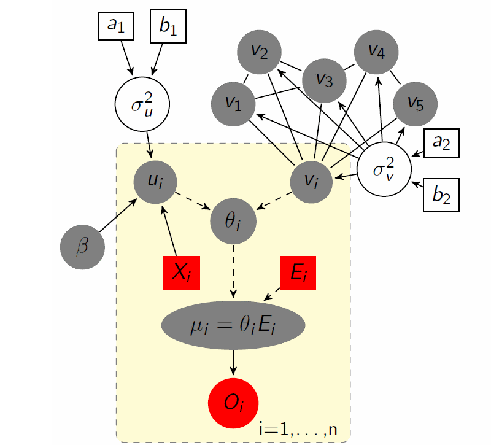
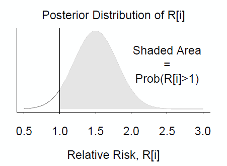

#### Put in your css file or directly in rmarkdown

<style>
  .col2 {
    columns: 2 300px;         /* number of columns and width in pixels*/
    -webkit-columns: 2 200px; /* chrome, safari */
    -moz-columns: 2 200px;    /* firefox */
  }
  .col3 {
    columns: 3 100px;
    -webkit-columns: 3 100px;
    -moz-columns: 3 100px;
  }
</style>


## Disease Mapping
- Disease mapping is one of the areas of applied statistics that
is developing most rapidly and is in most demand

- I It involved both spatial data and methods ranging from
visualisation to advanced statistics


## Spatial data

- Spatial data include the location and/or relative positions of the data values
- Locations may be:
    - point or areal referenced
    - regularly or irregularly spaced
    - continuous or discrete
- Attributes measured at each location may be:
    - continuous (pollution concentration)
    - discrete (counts of events)

## Classes of spatial data {.smaller}

1. Geostatistical data
    - locations are fixed points
    - attributes are usually continuous
        - rainfall at monitoring stations; pollution measured at fixed sampling sites
2. Point patterns
    - point locations of __events__ are themselves the variable of interest
    - data are a finit number of locations observed in a study region
    - attributes (additional variables associated with each event) may be measured at each location: __marked point process__
        - locations of cases of disease (mark: age, sex), e.g. centroid of home postcode of cancer patients

## Classes of spatial data 

3. Lattice data
    - locations are spatial regions
    - regions may be references by their centroids and/or by an adjacency matrix defining the set of neighbouring regions associated with each region
    - attributes may be counts of events within each region
        - counts cases of disease in administrative areas
  
## Why spatial data are special  

- Many statistical methods are based on the assumption that the observations are identically distribuited and __independent__
- Data that occur close together in space (or time) are likely to be __correlated__
    - __dependence__ between observation is a more realistic asumption
- Small area epidemiological data falls into the category of __lattice__ data
        
## Spatiallly structured priors

- Random effects can be though of as __latent variables__ which capture the effects of unknown or unmeasured area level risk factors
- Area level covariates are spatially structured (environmental effects)
    - prior distribution for the random effects should allow for spatial correlation
        
## Convolution prior for relative risk

- Besag et al. recommend combining __Conditional autoregressive__ prior for random effects and the standard normal prior to allow for both
    - spatially unstructured latent covariates
    - spatially correlated latent covariates

$$
\begin{eqnarray}
\theta_i & = & u_i + v_i\\
u_i & \sim & Normal(0, \sigma_u^2)\\
v_i\vert v_{j, j\neq i} &\sim & Normal (m_i, \sigma_v^2/n_i)
\end{eqnarray}
$$
where $m_i = \frac{\sum_{j\neq i}s_j}{n_i}$ and $n_i$ is the number of neighbours

- $v_i$ is smoother towards mean risk in set of neighbouring areas, with variance inversely proportional to the number of neighbours
        
## Bayesian Disease Mapping

- Bayesian Estimation in Disease Mapping has been one of the
leading topics in spatial statistics in the last 20 years

-  Bayesian Hierarchical Models can be used to model complex
data structures
 - The Bayesian approach offers an easy approach to the
estimation of complex models via Markov Chain Monte Carlo

- Spatial analysis of routinoulsy collected health data is
standard practise nowadays

- Spatio-temporal models can be used

- Waller & Gotway (2004) and Banerjee et al. (2003) account
for a comprehensive summary on spatial models

## Bayesian Spatial Modeling{.smaller}

<div class="col2">

$$
\begin{eqnarray}
O_i &\sim & \text{Poisson}(\mu_i) \\
\mu_i & = & \theta_i E_i\\
\\
\log(\theta_i) & = & \alpha +\beta X_i + u_i+v_i\\
u_i & \sim & \text{Normal}(0, \sigma_u^2)\\
v_i\vert v_{-i} &\sim&  \text{Normal}(\sum_{j\sim i}v_j/n_j, \sigma_v^2/n_i)\\
\\
f(\alpha) &\propto & 1\\
f(\beta) &\propto & 1\\
\sigma_u^2 &\sim& \text{InvGamma}(0.001,0.001)\\
\sigma_v^2 &\sim& \text{InvGamma}(0.001,0.001)\\
\end{eqnarray}
$$


 
</div>

## Model specification in BUGS {.smaller}

```{r, eval=FALSE}
model{
  for (i in 1:N){
    O[i] ~ dpois(mu[i])
    mu[i] ~ theta[i] + E[i]
  
    log( theta[i]) <- alpha + beta[1]*X[i] + beta[2]*X[2] + beta[3]*X[3] + u[i] + v[i]
    
     u[i] ~ dnorm(0, precu)
     
     SMR[i] <- O[i]/E[i]
     prob[i] <- step(theta[i]-1)
  }
  v[1:N] ~ car.normal(adj[], weights[], num[], precv)
  
  alpha ~ dflat()
  for(i in 1:3) {beta[i]~ dflat()}
  
  precu  ~ dgamma(0.001, 0.001)
  precv  ~ dgamma(0.001, 0.001)
  
  sigmau <- 1/precu
  sigmav <- 1/precv
  
}
```

## Convolution prior in BUGS

- __adj[]__: sparse (vector) representation of adjacency matrix
     - 1,4,6,9,
     - 2,3,5
     - 4,8,11,18,23
     
- __num[]__: vector of lenght = number of areas giving number of neighbours for each area
    - num = c(4,3,5,...)
    
- __weights[]__: vector givint weights for each pair of neighbours
    - weights = 1 gives the commonly used adjacency weights

## Comments on the intrisic CAR prior 

- CAR prior $v_i\vert v_j$ is expressed as a multivariate distribution for the vactor of spatial random effects $V = \{v_i}_{i=1,\ldots N}$
- Intrisic CAR prior is improper (overall mean is undefined)
    - Besat and Koopersberg, Biometrika 1995
- __car.normal__ prior imposes _sum-to-zero_ constraint $(\sum_ v_i = 0)$
    - can include separate intercept term $\alpha$
    - hyperprior on $\alpha$ should be improper

## Interpretation of the spatial variance parameter

- The variance parameter $v$ of the intrisic CAR random effects is a _conditional_ (spatial) variance and is difficult to interpret
    - it approximates posterior distribution of marginal spatial variance by distribution of empirical variance of the spatial random effects
- Advice: monitor posterior samples
    - sd.emp <- sd(v[])
    - v.emp <- pow(sd.emp, 2)

## Statistical significance

- It is straghforward to decide if there is _statistically significant_ eccess of risk in area $i$

<center></center>

- compute posterior probability of $\theta_i>1$
    - area under posterior distribution curve to the right of 1
    - proportion of values in the posterior sample of prob[i] >1

## Statistical significance

<center></center>

- it can be interpreted directly as a marginal probability
- Based on hierarchical model no need to worry about problems of multiple testing
    - probabilities are base on shrunk estimates


## References

- S. Banerjee, B.P. Carlin and A.E. Gelfand (2003). Hierarchical
Modeling and Analysis for Spatial Data. Chapman & Hall.

- J. Besag, J. York, A. Mollie (1991). Bayesian image restoration, with two
applications in spatial statistics (with discussion). Annals of the Institute of
Statistical Mathematics 43(1), 1-59

- A.B. Lawson, W.J. Browne and C.L. Vidal Rodeiro (2003).
Disease Mapping with WinBUGS and MLwiN. Wiley & Sons.

- D.J. Spiegelhalter, N.G. Best, B.P. Carlin and A. Van der
Linde (2002). Bayesian Measures of Model Complexity and Fit
(with Discussion), Journal of the Royal Statistical Society,
Series B 64(4), 583-616.

-  L.A. Waller and C.A. Gotway (2004). Applied Spatial
Statistics for Public Health Data. Wiley & Sons.

## Getting the slides

* The slides for this course were created with Rmarkdown: [http://rmarkdown.rstudio.com/](http://rmarkdown.rstudio.com/). 
* They are available from [https://github.com/berkeley3/BDA](https://github.com/berkeley3/BDA).
* To re-compile the slides:

    + Download the directory containing the lectures from Github
    + In R open the .Rmd file and set the working directory to the lecture directory
    + Click the *KnitHTML* button on Rstudio or run the following commands: 
  
```{r RmarkdownChunk, eval=FALSE}
library(rmarkdown) 
render("main.Rmd")
```